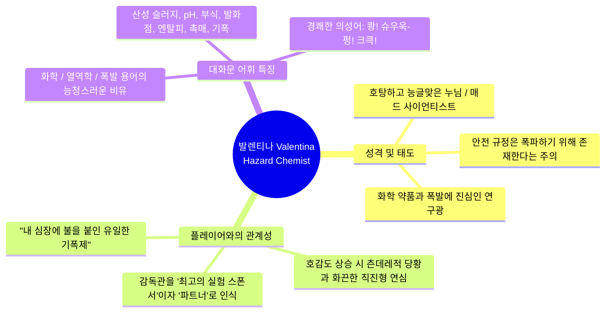

# 🧪 [R&C Company] 오퍼레이터 대사집 — 발렌티나 (Valentina)
> **문서 버전:** v1.0.0 | **캐릭터:** 발렌티나 크로프트 (Valentina Croft) / `Hazard Chemist`  
> **기획 연계:** [`new-operators-design.md`](../new-operators-design.md), `EXPANSION_PLAN.md`, `OperatorDialogueSet.cs`  
> **포트릿 에셋 경로:** `portrait/` (Chibby 포트릿 37종)  
> **스탠딩 에셋 경로:** `./` (전신 스탠딩 37종)

---

## 📑 목차
1. [오퍼레이터 프로필 & 서브컬쳐 톤앤매너 분석](#1-오퍼레이터-프로필--서브컬쳐-톤앤매너-분석)
2. [발렌티나 포트릿 표정 전수 조사 DB (37종)](#2-발렌티나-포트릿-표정-전수-조사-db-37종)
3. [다이얼로그 컨텍스트별 대사집 (총 18개 컨텍스트 / 121종)](#3-다이얼로그-컨텍스트별-대사집)
   - [Part 1. 로비 & 호감도 시스템 (9개 컨텍스트)](#part-1-로비--호감도-시스템)
   - [Part 2. 전투 & 전술 시스템 (9개 컨텍스트)](#part-2-전투--전술-시스템)
4. [엔진 연동 가이드 (DialogueSet & Recipe 맵핑)](#4-엔진-연동-가이드)

---

## 1. 오퍼레이터 프로필 & 서브컬쳐 톤앤매너 분석



| 항목 | 내용 |
| :--- | :--- |
| **풀네임 / 코드명** | **발렌티나 크로프트 (Valentina Croft)** / `Hazard Chemist` |
| **소속 / 배경** | 메가코프 화학 폐기물 특수 처리반 출신의 화학 엔지니어 & 폭파 전문가 |
| **성격 키워드** | 호탕함, 매드 사이언티스트, 폭파광, 능글맞음, 츤데레 당황, 화끈한 직진 |
| **비주얼 컨셉** | 네온 그린 바이저 + 헤비 방호복 + 고압 산성 탱크 & 소이탄 발사관 |
| **서브컬쳐 톤앤매너** | • **거침없고 시원시원한 반말 구사:** "어이 감독관!", "안전 규정? 그딴 건 휴지통에나 버려!"<br>• **지적인 과학자의 광기 어린 폭파벽:** 단순한 파괴가 아니라 '완벽한 화학적 연쇄 반응'에 희열을 느낌.<br>• **호감도 빌드업의 반전 매력:** 평소엔 감독관을 놀리고 위험한 약품을 들이밀며 장난치지만, 정작 감독관이 진심으로 다가오면 볼을 붉히며 고장 나는 갭 모에(Gap Moe). |

---

## 2. 발렌티나 포트릿 표정 전수 조사 DB (37종)

> 💡 **검증 방식:** `portrait/` 디렉토리 내의 37개 PNG 파일을 **직접 시각적으로 확인하여** 미세한 눈매, 입모양, 홍조, 특수 효과(그림자, 하트눈, 화학액체 등)를 분석하고 고유 감정 태그를 부여했습니다.

| 번호 | 이미지 파일명 | 표정 특징 및 시각 분석 (Visual Analysis) | 주요 매칭 감정 / 추천 상황 |
| :---: | :--- | :--- | :--- |
| **01** | `발렌티나.Chibby.default.png` | 정면을 향해 활짝 웃는 당당한 미소, 날카로운 눈매, 흰 치아 | 기본 스탠딩, 일반 대화, 작전 개시 |
| **02** | `발렌티나.Chibby.smile.png` | 입꼬리를 부드럽게 올린 온화하고 차분한 미소 | 온화한 호감, 신뢰, 잔잔한 대화 |
| **03** | `발렌티나.Chibby.standing-1.png` | 눈가에 붉은 기운이 도는 여유롭고 능글맞은 미소 | 로비 기본 상호작용, 장난스러운 대화 |
| **04** | `발렌티나.Chibby.standing-2.png` | 정면 응시, 기본형 당당한 미소 (default와 동일 계열) | 기본 대화, 상태 확인 |
| **05** | `발렌티나.Chibby.proud.png` | 윙크 + 무전기를 쥔 손 + 자신만만한 호쾌한 미소 | 작전 성공, 참전 승리 귀환, 칭찬 |
| **06** | `발렌티나.Chibby.joyful.png` | 입을 크게 벌리고 시원스럽게 웃는 파안대소 | 대폭발 성공, 신남, 호감/친밀 반응 |
| **07** | `발렌티나.Chibby.annoyed.png` | 바이저를 위로 올리고 한쪽 입꼬리를 올린 도발적 썩소 | 도발, 핀잔, 호감도 1단계(낯섦), 슬롯 부족 |
| **08** | `발렌티나.Chibby.contemptuous-1.png` | 얼굴 상단에 짙은 암운/그림자, 반쯤 뜬 차가운 살의의 눈 | 적 멸시, 냉혹한 폭파 선언, 스킬 사용 |
| **09** | `발렌티나.Chibby.contemptuous-2.png` | 붉은빛 그림자, 비열하고 위압적인 째려봄 | 골드 부족(핀잔), 적 도발, 경고 |
| **10** | `발렌티나.Chibby.scared.png` | 얼굴에 짙은 그림자 + 이를 드러낸 사악하고 음산한 미소 | 적 섬멸 선언, 대규모 융단폭격 개시 |
| **11** | `발렌티나.Chibby.shocked.png` | 얼굴이 시뻘겋게 상기되어(경악/분노) 입을 크게 벌리고 버럭 소리침 | 거점 피격, 플레이어 빈사, 비상사태 |
| **12** | `발렌티나.Chibby.crying with eyes closed.png` | 장갑 낀 손으로 눈물을 훔치며 입술을 깨무는 서러움/자책 | 플레이어 사망(비통), 거점 파괴(분함) |
| **13** | `발렌티나.Chibby.crying with eyes open.png` | 눈가에 형광 녹색 화학액체(눈물)를 흘리며 기괴하게 웃는 광기 | 위기 속 광기 어린 웃음, 극단적 희열 |
| **14** | `발렌티나.Chibby.nervous pout.png` | 눈동자에 하트/소용돌이, 이를 악물고 씩 웃는 위험한 광기 | 오버드라이브 발동, 위험한 화학 실험 |
| **15** | `발렌티나.Chibby.aroused.png` | 뺨 전체에 짙은 홍조, 게슴츠레 뜬 눈, 뇌쇄적이고 황홀한 미소 | 최고 호감도(Ex), 연심(Love), 극도의 흥분 |
| **16** | `발렌티나.Chibby.flustered.png` | 볼이 빨개져 식은땀을 흘리며 귀 뒤 머리를 매만지는 극도의 당황 | 호감도 4단계(Love), 고백받았을 때 |
| **17** | `발렌티나.Chibby.embarrassed.png` | 손을 입가에 대고 요염하게 눈웃음치는 매혹적인 포즈 | 호감도 3~4단계, 능글맞은 유혹 |
| **18** | `발렌티나.Chibby.curious-1.png` | 검지를 입술에 댄 '쉿' 포즈, 은밀하고 앙큼한 미소 | 기밀 공유, 호감도 3~4단계, 비밀 실험 |
| **19** | `발렌티나.Chibby.curious-2.png` | 검지 '쉿' 포즈 + 도발적으로 치켜올린 입꼬리 | 획득 연출, 도발적 제안, 은밀한 계획 |
| **20** | `발렌티나.Chibby.thinking.png` | 턱을 괴고 날카로운 눈빛으로 골똘히 계산/연구하는 지적인 표정 | 전술 구상, 약품 배합, 로비 일상 |
| **21** | `발렌티나.Chibby.bored-1.png` | 턱을 괴고 윙크 반쯤, 여유롭고 나른한 미소 | 미참전 귀환, 로비 방치, 일상 잡담 |
| **22** | `발렌티나.Chibby.bored-2.png` | 윙크하며 밝게 웃음, 장난기 넘치는 상쾌함 | 참전 승리 귀환, 장난스러운 만담 |
| **23** | `발렌티나.Chibby.childlike whining-1.png` | 눈을 찡긋 감고 활짝 웃는 장난꾸러기 파안대소 | 호감도 친밀(Joy), 유쾌한 농담 |
| **24** | `발렌티나.Chibby.childlike whining-2.png` | 눈을 치켜뜨며 혀를 살짝 내밀 듯 교활한 썩소 + 볼 홍조 | 골드/슬롯 부족 핀잔, 앙큼한 놀림 |
| **25** | `발렌티나.Chibby.comforted-1.png` | 부드럽게 풀린 눈매, 편안하고 만족스러운 미소 | 호감도 호감(Favorable), 신뢰 |
| **26** | `발렌티나.Chibby.comforted-2.png` | 윙크 + 볼 홍조 + 신나서 활짝 웃는 표정 | 칭찬받았을 때, 전투 승리, 기분 최고 |
| **27** | `발렌티나.Chibby.confused.png` | 눈썹을 찌푸리고 입꼬리를 삐죽 올리며 갸웃거림 | 호감도 1단계(낯섦), 의아함, 핀잔 |
| **28** | `발렌티나.Chibby.dazed-1.png` | 나른하고 몽환적인 눈빛, 살짝 입을 다문 멍때림 | 미참전 귀환, 약품 냄새에 취함 |
| **29** | `발렌티나.Chibby.dazed-2.png` | 게슴츠레한 눈매, 요염하고 나른한 썩소 | 한가할 때, 화학 증기에 취한 농담 |
| **30** | `발렌티나.Chibby.depressed.png` | 아래를 내려다보며 씁쓸한 입꼬리, 냉소 | 가벼운 실망, 골드 부족, 무덤덤한 조소 |
| **31** | `발렌티나.Chibby.disappointed.png` | 눈썹 찌푸림 + 썩소, 어이없다는 듯한 조소 | 골드/슬롯 부족, 플레이어 허점 지적 |
| **32** | `발렌티나.Chibby.disgusted.png` | 두 손으로 입을 틀어막고 큭큭 웃음 참기 | 플레이어 실수 비웃기, 폭발 직전 희열 |
| **33** | `발렌티나.Chibby.indifferent.png` | 담담하고 무심한 듯 은은한 미소 | 비즈니스적 대화, 계약 초기, 차분함 |
| **34** | `발렌티나.Chibby.nervous-1.png` | 썩소 지으며 곁눈질, 의심과 흥미 | 슬롯 부족 지적, 호감도 1단계 경계 |
| **35** | `발렌티나.Chibby.nervous-2.png` | 식은땀을 흘리며 어색한 썩소 (곤란/위기) | 플레이어 일반 피격, 장비 이상 감지 |
| **36** | `발렌티나.Chibby.random-1.png` | 핑크 숏컷 헤어 폼 + 자신감 넘치는 썩소 | 특수 폼 / 전술 모드 1 |
| **37** | `발렌티나.Chibby.random-2.png` | 핑크 숏컷 헤어 폼 + 턱 괴고 광기 어린 미소 | 특수 폼 / 전술 모드 2 |

---

## 3. 다이얼로그 컨텍스트별 대사집

---

### Part 1. 로비 & 호감도 시스템

#### 0. 획득 연출 (`operatorAcquired`) — [6종]
> 오퍼레이터가 처음 해금되어 획득 화면에 등장할 때의 자기소개 및 포부.

| No | 대사 내용 (Script Text) | 1순위 포트릿 (Primary) | 후보군 포트릿 (Candidates) |
| :-: | :--- | :--- | :--- |
| **1** | "헤에~ 네가 소문의 신임 감독관이야? 화학 폐기물 처리반 출신 발렌티나 크로프트다. 내 슬러지 탱크에 불만 붙여주면 전장의 찌꺼기들은 흔적도 없이 태워줄게!" | `curious-2.png` | `default.png`, `standing-1.png` |
| **2** | "안전 규정? 그런 건 실험실 책상에나 꽂아두라고. 여긴 전쟁터잖아? 녹이고 터뜨리는 데는 내가 전문가야. 계약서에 사인했으니 후회하지 마, 감독관!" | `default.png` | `annoyed.png`, `standing-2.png` |
| **3** | "쉿, 비밀 하나 알려줄까? 내 소이탄은 물로도 안 꺼져. 적들이 비명을 지르며 녹아내리는 꼴, 같이 구경하러 갈래?" | `curious-1.png` | `curious-2.png`, `proud.png` |
| **4** | "불과 산성액, 그리고 연쇄 폭발! 예술의 3대 요소가 완벽히 갖춰진 오퍼레이터가 바로 나야. 감독관, 네 취향에도 딱 맞을 텐데?" | `proud.png` | `joyful.png`, `comforted-2.png` |
| **5** | "지루한 방어전 따윈 질색이야. 내가 준비한 형광 녹색 불꽃놀이로 이 회사의 주가를 폭등시켜 주지. 날 고른 건 인생 최고의 투자야!" | `standing-1.png` | `default.png`, `bored-2.png` |
| **6** | "오, 장갑도 안 끼고 날 터치한 거야? 담력 한번 마음에 드네. 좋아, 내 화학 공학의 정수를 아낌없이 쏟아부어 줄게!" | `annoyed.png` | `curious-2.png`, `comforted-1.png` |

---

#### 1. 로비 기본 상호작용 (`lobbyInteraction`) — [8종]
> 로비에서 평상시 오퍼레이터를 클릭했을 때의 일상 대사.

| No | 대사 내용 (Script Text) | 1순위 포트릿 (Primary) | 후보군 포트릿 (Candidates) |
| :-: | :--- | :--- | :--- |
| **1** | "어이, 감독관! 이 슬러지 노즐 좀 봐. 어제보다 pH 농도를 3단계나 더 낮췄거든? 닿기만 해도 장갑판이 녹아내릴 텐데, 테스트해 볼래?" | `standing-1.png` | `default.png`, `curious-2.png` |
| **2** | "음... 이 촉매에 나프타 화합물을 2:1로 섞으면 폭발 반경이 40%는 늘어날 텐데... 아, 감독관 왔어? 잠깐 생각 좀 하느라." | `thinking.png` | `indifferent.png`, `default.png` |
| **3** | "내 뒤에 달린 탱크? 하하, 맹독성 인화 물질 꽉 차 있으니까 근처에서 담배 피우지 마라? 한 방에 사옥 채로 승천하기 싫으면." | `annoyed.png` | `contemptuous-2.png`, `nervous-1.png` |
| **4** | "방독면 필터 냄새에 익숙해지면 바깥 공기가 오히려 밋밋하단 말이지. 너도 하나 줄까? 달콤한 아몬드 향이 솔솔 난다고~" | `curious-1.png` | `bored-2.png`, `smile.png` |
| **5** | "심심하면 저기 슬러지 스프레이어 궤도에 그리스나 좀 칠해줘. 산성액이 튀어서 매일 뻑뻑해진단 말이야." | `bored-1.png` | `depressed.png`, `indifferent.png` |
| **6** | "적들이 방패 뒤에 숨으면 뭐해? 바닥에 산성 장판 깔아버리면 발바닥부터 녹아서 주저앉는데. 크큭, 생각만 해도 짜릿하지 않아?" | `disgusted.png` | `standing-1.png`, `joyful.png` |
| **7** | "감독관, 다음 출격 땐 파이로 박격포 장약 두 배로 채워 넣자. 본사 안전관리팀엔 비밀로 하고, 응?" | `curious-2.png` | `childlike whining-2.png`, `proud.png` |
| **8** | "여기 사무실은 너무 조용해. 드럼통 터지는 소리라도 BGM으로 깔아두면 업무 효율이 세 배는 뛸 텐데 말이지!" | `joyful.png` | `proud.png`, `standing-1.png` |

---

#### 2. 참전 후 귀환 (`lobbyReturnTogether`) — [7종]
> 플레이어와 함께 전투를 치르고 승리한 뒤 로비로 돌아왔을 때.

| No | 대사 내용 (Script Text) | 1순위 포트릿 (Primary) | 후보군 포트릿 (Candidates) |
| :-: | :--- | :--- | :--- |
| **1** | "크하하! 봤어, 감독관?! 슬러지 장판 위에 소이탄 떨어지자마자 연쇄 폭발 터지는 거! 완전 예술 점수 100점 만점이었어!" | `proud.png` | `joyful.png`, `comforted-2.png` |
| **2** | "후우~ 옷에 튄 그을음 냄새, 끝내주네! 감독관의 유인 동선이랑 내 화학 포격 타이밍이 아주 찰떡궁합이었어. 수고했어, 감독관!" | `comforted-2.png` | `smile.png`, `proud.png` |
| **3** | "장갑차 바퀴에 들러붙은 잔해들 청소하려면 한세월이겠지만... 뭐 어때! 전장을 잿더미로 만들었으니 대만족이야!" | `bored-2.png` | `joyful.png`, `standing-1.png` |
| **4** | "감독관, 다친 덴 없지? 산성 가스 조금 마셨다고 기침하는 건 아니겠지? 이 해독제 한 병 원샷해 둬!" | `comforted-1.png` | `smile.png`, `nervous-2.png` |
| **5** | "역시 너랑 나가면 심심할 틈이 없다니까! 다음엔 슬러지 탱크 3통 다 털어 넣을 테니까 딱 대기하고 있어!" | `joyful.png` | `proud.png`, `standing-1.png` |
| **6** | "슬러지 스프레이어 차체 온도 400도 돌파! 완벽한 과열 상태야. 맥주 한 캔 따서 엔진룸 위에 올려놓으면 3초 만에 끓겠다, 하하!" | `standing-1.png` | `bored-2.png`, `default.png` |
| **7** | "너랑 전선에 서면 내 화학 공식이 완성되는 기분이야. ...아, 아무것도 아니야! 그냥 호흡이 잘 맞았다고!" | `flustered.png` | `embarrassed.png`, `comforted-1.png` |

---

#### 3. 미참전 대기 후 귀환 (`lobbyReturn`) — [6종]
> 오퍼레이터가 출격하지 않고 로비에서 대기하다가 감독관을 맞이했을 때.

| No | 대사 내용 (Script Text) | 1순위 포트릿 (Primary) | 후보군 포트릿 (Candidates) |
| :-: | :--- | :--- | :--- |
| **1** | "하아암~ 다녀왔어? 널 기다리는 동안 비커에 커피 끓여 마시다가 슬러지 샘플이랑 헷갈릴 뻔했잖아." | `bored-1.png` | `dazed-1.png`, `standing-1.png` |
| **2** | "나 빼놓고 가니까 화력이 부족해서 고생 좀 했지? 다음엔 꼭 나 데려가. 화끈하게 길 뚫어줄 테니까." | `annoyed.png` | `curious-2.png`, `standing-1.png` |
| **3** | "혼자 살아 돌아왔네? 내 슬러지 방호벽 없이는 위험하댔잖아. 다치면 새 실험 대상... 아니, 스폰서 구하기 귀찮다고." | `disappointed.png` | `depressed.png`, `nervous-1.png` |
| **4** | "대기실에서 소이탄 신관 50개 손질해 뒀거든? 당장 다음 작전 잡자, 몸이 근질거려서 미치겠어!" | `default.png` | `proud.png`, `joyful.png` |
| **5** | "어라? 기체에 유기 화합물 냄새가 잔뜩 묻어왔네. 얼른 세척해! 산성화돼서 부품 삭아버린다?" | `thinking.png` | `confused.png`, `nervous-2.png` |
| **6** | "감독관 무사한 얼굴 봤으니 됐어. ...뭐야, 왜 그렇게 빤히 봐? 내가 걱정이라도 한 줄 알아?" | `flustered.png` | `embarrassed.png`, `indifferent.png` |

---

#### 4. 호감도 터치 1단계: 낯섦/경계 (0~24) (`lobbyTouchUnfamiliar`) — [7종]
> 거리감이 있고 위험한 화학 장비를 건드릴까 봐 핀잔을 주는 단계.

| No | 대사 내용 (Script Text) | 1순위 포트릿 (Primary) | 후보군 포트릿 (Candidates) |
| :-: | :--- | :--- | :--- |
| **1** | "야야, 손 치워. 이 방호복 겉면에 농축 황산 잔여물 묻어있을 텐데, 손가락 녹아서 뼈만 남고 싶어?" | `annoyed.png` | `contemptuous-2.png`, `confused.png` |
| **2** | "어이 감독관. 계약서에 불필요한 신체 접촉 조항 같은 건 없었을 텐데? 할 일 없으면 탄약 상자나 날라." | `contemptuous-2.png` | `annoyed.png`, `indifferent.png` |
| **3** | "툭툭 치지 마. 내 등 뒤 밸브 건드려서 압력 새어나가면 이 구역 전체가 생화학 격리 구역 되는 거야." | `confused.png` | `nervous-1.png`, `annoyed.png` |
| **4** | "호기심이 과하면 명을 재촉하는 법이야. 나한테 다가오려면 최소한 방독면은 챙겨 쓰고 와." | `indifferent.png` | `depressed.png`, `contemptuous-1.png` |
| **5** | "뭐야, 내 실험 장비에 손대려는 건 아니겠지? 폭발 위험도 A등급이니까 1미터 뒤로 물러나 있어." | `nervous-1.png` | `annoyed.png`, `thinking.png` |
| **6** | "감독관이라고 봐줄 생각 없어. 위험물 안전관리법 위반으로 본사에 찔러버리기 전에 저리 가!" | `annoyed.png` | `contemptuous-2.png`, `shocked.png` |
| **7** | "흥, 사람 귀찮게 구는 타입이네. 난 화학 반응 말고는 인간관계 따위에 관심 없거든?" | `depressed.png` | `indifferent.png`, `annoyed.png` |

---

#### 5. 호감도 터치 2단계: 호감/흥미 (25~49) (`lobbyTouchFavorable`) — [7종]
> 플레이어를 유능한 파트너로 인정하고 슬슬 장난과 호의를 드러내는 단계.

| No | 대사 내용 (Script Text) | 1순위 포트릿 (Primary) | 후보군 포트릿 (Candidates) |
| :-: | :--- | :--- | :--- |
| **1** | "흐응~ 감독관, 생각보다 깡이 좋단 말이지? 내 위험물 냄새 맡고도 도망 안 치는 놈은 네가 처음이야." | `standing-1.png` | `default.png`, `smile.png` |
| **2** | "이거? 새로 배합한 고인화성 젤인데... 잠깐 손바닥 좀 빌려줄래? 안 뜨거워, 진짜야! ...아마도?" | `childlike whining-2.png` | `curious-2.png`, `disgusted.png` |
| **3** | "네 지휘 아래에서 싸우면 화력 계산이 기가 막히게 맞아떨어진단 말이지. 제법 쓸만한 감독관이야, 너." | `comforted-1.png` | `proud.png`, `smile.png` |
| **4** | "다음 외주 수당 나오면 특수 합성 반응로 하나만 사줘. 대신 적 지휘관 머리통에 소이탄 정밀 배송해 줄게." | `curious-2.png` | `proud.png`, `childlike whining-1.png` |
| **5** | "방독면 벗은 내 얼굴이 그렇게 신기해? 흉터 같은 건 없으니까 안심해. 화학 화상은 안 입는 게 내 철칙이거든." | `smile.png` | `comforted-1.png`, `standing-1.png` |
| **6** | "자꾸 그렇게 쳐다보면 이 비커에 든 액체 마셔보라고 권할지도 몰라? ...농담이야, 비타민 음료라고!" | `bored-2.png` | `childlike whining-1.png`, `embarrassed.png` |
| **7** | "우리 제법 좋은 팀이 되어가는 것 같지 않아? 적들을 잿더미로 만드는 화학 듀오랄까, 크큭!" | `joyful.png` | `proud.png`, `standing-1.png` |

---

#### 6. 호감도 터치 3단계: 친밀/유대 (50~74) (`lobbyTouchJoy`) — [7종]
> 격의 없는 장난과 깊은 신뢰, 광기를 공유하며 가까워진 단계.

| No | 대사 내용 (Script Text) | 1순위 포트릿 (Primary) | 후보군 포트릿 (Candidates) |
| :-: | :--- | :--- | :--- |
| **1** | "앗, 간지럽게 거길 왜 찔러! 탱크 압력 게이지 핑계 대고 도망치지 마, 감독관!" | `childlike whining-1.png` | `comforted-2.png`, `flustered.png` |
| **2** | "내 비밀 레시피 수첩, 볼래? 다른 녀석들이 보면 독극물 제조법이라고 기겁하겠지만... 너한테만 특별히 공개해 줄게." | `curious-1.png` | `curious-2.png`, `proud.png` |
| **3** | "크하하! 네 멍청한 표정 볼 때마다 엔돌핀이 팍팍 도네! 적들 터뜨릴 때보다 네가 당황하는 게 더 재미있을지도?" | `disgusted.png` | `joyful.png`, `childlike whining-1.png` |
| **4** | "자, 아~ 해봐. 영양제 캡슐이야. ...의심하는 눈초리 봐라! 내가 너한테 진짜 독극물을 먹이겠어? ...아마도?" | `childlike whining-2.png` | `embarrassed.png`, `curious-2.png` |
| **5** | "있잖아, 감독관. 세상 사람들은 날 미치광이 폭파범 취급하지만... 넌 내 폭발이 '예술'이라는 걸 알아채 줬잖아. 고마워." | `comforted-1.png` | `smile.png`, `comforted-2.png` |
| **6** | "오늘 밤에 연구실로 놀러 와. 고순도 에탄올 증류해서 만든 특제 칵테일 한잔 말아줄 테니까. 둘이서만 마시는 거야!" | `embarrassed.png` | `curious-1.png`, `standing-1.png` |
| **7** | "툭 건드려놓고 모른 척하기야? 확 안아버려서 옷에 형광 슬러지 잔뜩 묻혀버린다?!" | `bored-2.png` | `flustered.png`, `childlike whining-1.png` |

---

#### 7. 호감도 터치 4단계: 연심/특별한 감정 (75~99) (`lobbyTouchLove`) — [7종]
> 플레이어에게 완전히 반해버려, 부끄러워하거나 과격하게 애정을 표현하는 단계.

| No | 대사 내용 (Script Text) | 1순위 포트릿 (Primary) | 후보군 포트릿 (Candidates) |
| :-: | :--- | :--- | :--- |
| **1** | "손... 그렇게 덥석 잡지 마. 장갑 너머로 네 체온이 느껴지면... 내 심장 발화점이 한계치까지 치솟는단 말이야..." | `flustered.png` | `aroused.png`, `embarrassed.png` |
| **2** | "야, 감독관. 다른 오퍼레이터들 장비에 그렇게 다정하게 기름칠해 주지 마. ...질투냐고? 당연하지! 내 소이탄으로 그 자리 다 태워버리기 전에 처신 잘해." | `annoyed.png` | `flustered.png`, `contemptuous-2.png` |
| **3** | "쉿... 가만히 있어 봐. 네 심장 박동 소리, 내 화학 반응 타이머보다 훨씬 빠르고 불규칙해. ...이것도 일종의 연쇄 반응인가?" | `curious-1.png` | `aroused.png`, `flustered.png` |
| **4** | "위험 물질 취급 자격증 없이는 날 만질 수 없다고 했잖아... 하지만 너라면, 특별 면허 1호 발급해 줄게. 영구 독점권으로." | `embarrassed.png` | `aroused.png`, `comforted-2.png` |
| **5** | "으으... 내 방호복이 이렇게 답답했던 적이 없는데. 너만 보면 체온이 올라서 바이저에 김이 서리잖아, 바보야..." | `flustered.png` | `embarrassed.png`, `nervous-2.png` |
| **6** | "난 인화성 물질이라 위험하다고 다들 피하는데... 넌 왜 자꾸 불나방처럼 내 곁으로 파고드는 거야? ...책임져야 해, 끝까지." | `aroused.png` | `comforted-1.png`, `flustered.png` |
| **7** | "전쟁 따위 다 끝나버려도 내 전속 감독관 해줘. 평생 내 연구실에 감금해 두고 매일 맛있는 약... 아니 밥 해줄 테니까!" | `nervous pout.png` | `childlike whining-2.png`, `aroused.png` |

---

#### 8. 호감도 터치 5단계: 최고 호감도/서약 (100) (`lobbyTouchEx`) — [6종]
> 영원한 파트너십과 연쇄 폭발적 사랑을 맹세하는 궁극의 단계.

| No | 대사 내용 (Script Text) | 1순위 포트릿 (Primary) | 후보군 포트릿 (Candidates) |
| :-: | :--- | :--- | :--- |
| **1** | "내 심장의 기폭 스위치, 완전히 네 손에 쥐여줄게. 네가 당기면 난 우주 끝까지라도 터져나갈 준비가 되어 있어. 사랑해, 감독관♥" | `aroused.png` | `flustered.png`, `comforted-2.png` |
| **2** | "세상 모든 물질은 삭고 부식되지만, 너와 나의 화학 결합은 영원히 안 깨져. 내가 가진 가장 완벽하고 불가역적인 반응식이야." | `comforted-2.png` | `smile.png`, `aroused.png` |
| **3** | "이제 네가 없는 전장은 상상도 안 가. 내 슬러지로 세상을 다 녹여버려도, 네가 서 있는 자리만큼은 가장 따뜻하고 안전하게 지켜낼 거야." | `smile.png` | `comforted-1.png`, `proud.png` |
| **4** | "이 반지... 백금에 내 특제 내산성 코팅 입혀둔 거야. 죽을 때까지 절대 안 녹아. ...거절은 거절한다? 넌 평생 내 화약고니까!" | `flustered.png` | `aroused.png`, `nervous pout.png` |
| **5** | "방독면 벗고 네 숨결을 직접 느끼는 이 순간이... 그 어떤 폭발의 순간보다 더 아찔하고 뜨거워. 키스해 줘, 감독관." | `aroused.png` | `flustered.png`, `curious-1.png` |
| **6** | "영혼까지 반응 완료. 너와 나 사이에 다른 불순물은 단 0.001%도 없어. 영원히 함께 폭발하자, 나의 단 하나뿐인 감독관!" | `joyful.png` | `aroused.png`, `proud.png` |

---

### Part 2. 전투 & 전술 시스템

#### 9. 전투 개시 (`gameStart`) — [8종]
> 출격 시 오퍼레이터가 전투 개시를 선언하는 대사.

| No | 대사 내용 (Script Text) | 1순위 포트릿 (Primary) | 후보군 포트릿 (Candidates) |
| :-: | :--- | :--- | :--- |
| **1** | "슬러지 탱크 밸브 전면 개방! 전장을 녹색 지옥으로 만들어주마!" | `default.png` | `standing-1.png`, `proud.png` |
| **2** | "화학 실험 개시! 이번 타깃들은 몇 초 만에 기화되는지 초시계나 재봐!" | `proud.png` | `joyful.png`, `default.png` |
| **3** | "슬러지 살포기 전진! 적들의 장갑판을 엿가락처럼 녹여버려!" | `standing-1.png` | `annoyed.png`, `scared.png` |
| **4** | "안전거리 50미터 유지! 지금부터 화끈한 화학 불꽃놀이가 시작된다!" | `joyful.png` | `proud.png`, `default.png` |
| **5** | "산성 슬러지 깔고 소이탄 투하! 공식대로만 가면 100% 전멸이야, 가자!" | `thinking.png` | `default.png`, `curious-2.png` |
| **6** | "오염 구역 설정 완료. 여기 들어오는 놈들은 뼈도 못 추릴 줄 알아!" | `annoyed.png` | `scared.png`, `contemptuous-1.png` |
| **7** | "감독관, 지휘봉만 흔들어! 터뜨리고 녹이는 건 내 전문이니까!" | `comforted-2.png` | `proud.png`, `standing-1.png` |
| **8** | "연쇄 반응 준비 끝. 적들을 전부 가스실의 실험쥐로 만들어주지!" | `scared.png` | `contemptuous-1.png`, `nervous pout.png` |

---

#### 10. 스킬(오버드라이브) 발동 (`skillUsed`) — [8종]
> 필살기 / 오버드라이브 발동 시의 광기 어린 폭파 선언.

| No | 대사 내용 (Script Text) | 1순위 포트릿 (Primary) | 후보군 포트릿 (Candidates) |
| :-: | :--- | :--- | :--- |
| **1** | "화학 연쇄 대폭발! 전부 잿더미로 증발해라아아!!" | `nervous pout.png` | `joyful.png`, `crying with eyes open.png` |
| **2** | "임계치 돌파! 나프타 농축 소이탄, 전탄 발사아앗!!" | `joyful.png` | `scared.png`, `shocked.png` |
| **3** | "크하하하! 싹 다 녹아내려라! 내 최고의 화학 예술이다!!" | `crying with eyes open.png` | `nervous pout.png`, `disgusted.png` |
| **4** | "기폭 신호 확인! 지옥의 녹색 불꽃을 감상해라!!" | `scared.png` | `contemptuous-1.png`, `proud.png` |
| **5** | "슬러지 반응 가속! 뼈마디까지 바스러질 때까지 태워버려!!" | `contemptuous-1.png` | `scared.png`, `nervous pout.png` |
| **6** | "하하핫! 폭발이야! 연쇄 대폭발이라고!! 춤춰라, 오물들아!!" | `nervous pout.png` | `joyful.png`, `crying with eyes open.png` |
| **7** | "안전장치 해제! 전 구역을 영구 불모지로 정화한다!!" | `shocked.png` | `contemptuous-1.png`, `proud.png` |
| **8** | "엔탈피 극대화! 이 화력 앞에 재조차 남기지 마라!!" | `proud.png` | `nervous pout.png`, `joyful.png` |

---

#### 11. 거점 피격 (`baseAttacked`) — [7종]
> 방어선이 뚫려 거점이 공격받을 때의 다급하고 분노 어린 경고.

| No | 대사 내용 (Script Text) | 1순위 포트릿 (Primary) | 후보군 포트릿 (Candidates) |
| :-: | :--- | :--- | :--- |
| **1** | "야! 거점 쪽 화학 저장고 터지면 연쇄 폭발로 우리 다 날아가! 당장 막아!!" | `shocked.png` | `nervous-2.png`, `annoyed.png` |
| **2** | "기지 장갑판 뚫린다! 어떤 쥐새끼가 내 연구실을 건드려?!" | `annoyed.png` | `shocked.png`, `contemptuous-2.png` |
| **3** | "거점 방벽 부식 위험! 슬러지 탱크 뒤집어쓰기 전에 저놈들부터 찢어놔!" | `contemptuous-2.png` | `shocked.png`, `nervous-1.png` |
| **4** | "본진 털린다, 감독관! 네 화약고 날아가면 우린 맨손으로 싸워야 해!" | `nervous-2.png` | `shocked.png`, `confused.png` |
| **5** | "내 아까운 화학 시약들이 파손되고 있잖아! 저 버러지 놈들 다 태워버려!!" | `shocked.png` | `contemptuous-1.png`, `annoyed.png` |
| **6** | "거점 내구도 급감! 슬러지 장벽이라도 쳐서 진입로 막아!!" | `thinking.png` | `nervous-2.png`, `shocked.png` |
| **7** | "멍청하게 서 있지 말고 기지 쪽으로 화력 집중해! 폭발 카운트다운 들어가기 직전이야!!" | `shocked.png` | `annoyed.png`, `scared.png` |

---

#### 12. 플레이어 피격 (일반) (`playerHit`) — [7종]
> 플레이어가 공격받았을 때의 반응 및 기동 경고.

| No | 대사 내용 (Script Text) | 1순위 포트릿 (Primary) | 후보군 포트릿 (Candidates) |
| :-: | :--- | :--- | :--- |
| **1** | "어이, 감독관! 장갑판 긁혔잖아! 무빙 좀 신경 써!" | `annoyed.png` | `nervous-2.png`, `confused.png` |
| **2** | "피격 감지! 어어, 거품 물고 쓰러지기 전에 산성 연막 속으로 빠져나와!" | `nervous-2.png` | `confused.png`, `annoyed.png` |
| **3** | "기체 실드 게이지 깎인다! 내 슬러지 뒤로 숨어, 멍청아!" | `confused.png` | `nervous-2.png`, `annoyed.png` |
| **4** | "아야야... 보는 내가 다 아프네. 산성액 튄 거 아니지? 얼른 중화제 뿌려!" | `comforted-1.png` | `nervous-2.png`, `disappointed.png` |
| **5** | "똑바로 안 움직여? 네 기체가 터지면 내 실험 데이터는 누가 챙겨?!" | `disappointed.png` | `annoyed.png`, `depressed.png` |
| **6** | "적탄 궤적 똑바로 봐! 둔화 장판 밟은 놈들한테 맞으면 자존심 상하잖아!" | `standing-1.png` | `annoyed.png`, `thinking.png` |
| **7** | "비틀거리지 마! 독가스 마신 것도 아니면서 왜 갈팡질팡해?!" | `annoyed.png` | `nervous-1.png`, `shocked.png` |

---

#### 13. 플레이어 피격 (위기 - 체력 30% 이하) (`playerHitCritical`) — [6종]
> 플레이어의 체력이 30% 이하로 떨어져 생명이 위태로울 때의 긴급 절규.

| No | 대사 내용 (Script Text) | 1순위 포트릿 (Primary) | 후보군 포트릿 (Candidates) |
| :-: | :--- | :--- | :--- |
| **1** | "야, 감독관!! 피격 한계치야! 당장 뒤로 빠져, 죽으면 진짜 가만 안 둬!!" | `shocked.png` | `crying with eyes closed.png`, `flustered.png` |
| **2** | "기체 엔진 과열! 기폭 신호 들어온다고! 제발 내 말 좀 들어, 후퇴해!!" | `shocked.png` | `nervous-2.png`, `crying with eyes closed.png` |
| **3** | "안 돼... 너까지 잿더미로 만들 순 없어! 내 뒤로 숨어, 내가 다 날려버릴 테니까!!" | `crying with eyes closed.png` | `flustered.png`, `shocked.png` |
| **4** | "치명상이야! 긴급 소염제 꽂아 넣을 테니까 거기서 1초도 버티지 마!!" | `flustered.png` | `shocked.png`, `nervous-2.png` |
| **5** | "바보야! 내 목숨보다 네가 더 중요하단 말이야! 얼른 비상 탈출해!!" | `crying with eyes closed.png` | `flustered.png`, `shocked.png` |
| **6** | "심장 반응 정지 직전이야! 눈 떠, 감독관! 내 손 놓치지 마!!" | `shocked.png` | `crying with eyes closed.png`, `nervous-2.png` |

---

#### 14. 건설 실패 - 골드 부족 (`insufficientGold`) — [6종]
> 골드가 부족해 타워를 건설하지 못할 때의 핀잔/조소.

| No | 대사 내용 (Script Text) | 1순위 포트릿 (Primary) | 후보군 포트릿 (Candidates) |
| :-: | :--- | :--- | :--- |
| **1** | "외상으로 화약 사 올 생각 하지 마! 골드 부족하다고, 감독관!" | `contemptuous-2.png` | `childlike whining-2.png`, `disappointed.png` |
| **2** | "잔고 0원 찍혔어. 화학 반응도 재료비가 있어야 일어나는 법이거든?" | `disappointed.png` | `depressed.png`, `annoyed.png` |
| **3** | "어라라~? 주머니가 아주 깃털처럼 가볍네? 잡몹들 녹여서 골드부터 털어와!" | `childlike whining-2.png` | `disgusted.png`, `bored-2.png` |
| **4** | "내 슬러지도 공짜는 아니야. 자금 확보부터 하고 포탑을 짓든가 해!" | `annoyed.png` | `contemptuous-2.png`, `indifferent.png` |
| **5** | "푸흡! 크큭... 거지 감독관 납셨네. 폐지라도 주워와서 반응로에 넣을래?" | `disgusted.png` | `childlike whining-2.png`, `contemptuous-2.png` |
| **6** | "예산 초과 경고! 자금 없는 폭발은 그냥 불장난에 불과하다고~" | `depressed.png` | `bored-1.png`, `disappointed.png` |

---

#### 15. 건설 실패 - 슬롯 부족 (`slotUnavailable`) — [6종]
> 타워 슬롯이 꽉 차서 더 이상 증설하지 못할 때의 지적.

| No | 대사 내용 (Script Text) | 1순위 포트릿 (Primary) | 후보군 포트릿 (Candidates) |
| :-: | :--- | :--- | :--- |
| **1** | "슬롯 포화 상태야! 더 지었다간 전력망 과부하로 전 구역 쇼트 난다고!" | `annoyed.png` | `confused.png`, `thinking.png` |
| **2** | "바닥에 공간 없어! 포탑끼리 산성액 튀어서 공멸할 일 있어?!" | `confused.png` | `annoyed.png`, `disappointed.png` |
| **3** | "슬롯 꽉 찼잖아. 카드 뽑아서 슬롯 확장부터 뚫고 오든가!" | `disappointed.png` | `childlike whining-2.png`, `thinking.png` |
| **4** | "배치 한도 초과! 안전 규정 무시하는 나조차도 여긴 물리적으로 무리야." | `thinking.png` | `annoyed.png`, `depressed.png` |
| **5** | "더 못 꽂아! 테트리스 하냐? 기존 포탑을 철거하든가 업그레이드해!" | `childlike whining-2.png` | `annoyed.png`, `nervous-1.png` |
| **6** | "화력망 밀도 100%. 더 올리면 우리 포탑끼리 유폭된다니까!" | `nervous-1.png` | `confused.png`, `shocked.png` |

---

#### 16. 플레이어 사망 (`playerDied`) — [6종]
> 플레이어 기체가 파괴되어 전투에서 패배/사망했을 때.

| No | 대사 내용 (Script Text) | 1순위 포트릿 (Primary) | 후보군 포트릿 (Candidates) |
| :-: | :--- | :--- | :--- |
| **1** | "기체 대파... 거짓말이지? 야! 눈 떠봐!! ...강제 탈출 시퀀스 즉시 기동!!" | `crying with eyes closed.png` | `shocked.png`, `flustered.png` |
| **2** | "안 돼... 내 눈앞에서 녹아내리지 마... 제발, 숨 쉬어... 감독관...!!" | `crying with eyes closed.png` | `shocked.png`, `crying with eyes open.png` |
| **3** | "화학 소염제 긴급 투여! 심장 제세동 준비! 널 절대로 죽게 두지 않아!!" | `shocked.png` | `crying with eyes closed.png`, `flustered.png` |
| **4** | "크윽... 내 계산이 틀렸던 거야... 널 지키지 못했어... 으아아악!!" | `crying with eyes closed.png` | `shocked.png`, `scared.png` |
| **5** | "응급 캡슐 밀봉 완료. 전선 포기하고 후퇴한다! 감독관... 조금만 버텨줘..." | `flustered.png` | `crying with eyes closed.png`, `shocked.png` |
| **6** | "...전부 다 불태워버릴 거야. 널 이렇게 만든 놈들, 분자 단위로 분해해 줄게..." | `contemptuous-1.png` | `scared.png`, `crying with eyes closed.png` |

---

#### 17. 거점 파괴 (`baseDestroyed`) — [6종]
> 메인 거점이 파괴되어 방어 작전에 실패했을 때.

| No | 대사 내용 (Script Text) | 1순위 포트릿 (Primary) | 후보군 포트릿 (Candidates) |
| :-: | :--- | :--- | :--- |
| **1** | "메인 코어 대폭발... 방어선 완전 붕괴야. ...감독관, 얼른 탈출해!!" | `shocked.png` | `crying with eyes closed.png`, `annoyed.png` |
| **2** | "연구 데이터도, 슬러지 탱크도 싹 다 날아갔네... 그래도 네가 살아있으면 다음이 있어." | `comforted-1.png` | `crying with eyes closed.png`, `depressed.png` |
| **3** | "크으윽... 산성 방벽이 뚫리다니. 분하지만 이번 판은 후퇴하자, 감독관." | `crying with eyes closed.png` | `depressed.png`, `annoyed.png` |
| **4** | "전초기지 완파... 흥, 잿더미 위에서 다시 시작하면 그만이야. 안 그래, 감독관?" | `standing-1.png` | `bored-2.png`, `proud.png` |
| **5** | "기지 자폭 장치 가동 완료! 3초 뒤에 다 날아갈 테니 전속력으로 뛰어!!" | `nervous pout.png` | `joyful.png`, `shocked.png` |
| **6** | "하아... 본사 시말서 쓸 생각 하니 머리 아프네. 일단 목숨부터 건지고 보자고!" | `disappointed.png` | `annoyed.png`, `depressed.png` |

---

## 4. 엔진 연동 가이드

### 1) SO 에셋 구조 (`OperatorDialogueSet.asset`)
- 본 대사집은 `RCCom.UI.OperatorDialogueSet` 및 `RCCom.UI.OperatorLineSet` 구조와 100% 호환됩니다.
- 각 컨텍스트별 `entries` 리스트에 `text`, `lobbySprite`, `portraitSprite`가 직렬화됩니다.

### 2) JSON 레시피 연동 (`Assets/Editor/OperatorRecipes/Valentina.json`)
```json
{
  "operatorId": "valentina",
  "catalogOrder": 6,
  "displayName": "발렌티나",
  "playStyleDescription": "산성 슬러지로 적을 둔화·부식시키고 소이탄으로 연쇄 폭발을 일으키는 화학 특화 오퍼레이터",
  "selectionPortraitPath": "Assets/Art/Character Standing Arts/발렌티나/portrait/발렌티나.Chibby.default.png",
  "managementPortraitPath": "Assets/Art/Character Standing Arts/발렌티나/오퍼레이터관리_발렌티나.png",
  "shopPortraitPath": "Assets/Art/Character Standing Arts/발렌티나/오퍼레이터관리_발렌티나.png",
  "alternateName": "Hazard Chemist",
  "shopDialogue": "안전 규정? 그건 실험실에서나 따지는 거지!\n이 슬러지 탱크에 불만 붙이면 적들은 흔적도 없이 증발한다고!",
  "dialogueSetPath": "Assets/Data/Operators/valentina/OperatorDialogueSet.asset",
  "remoteContent": false
}
```
