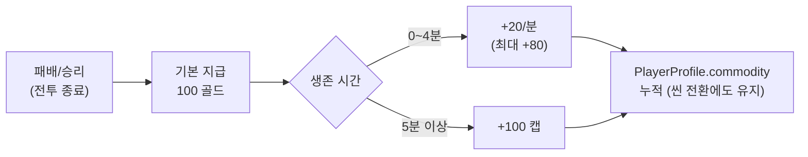
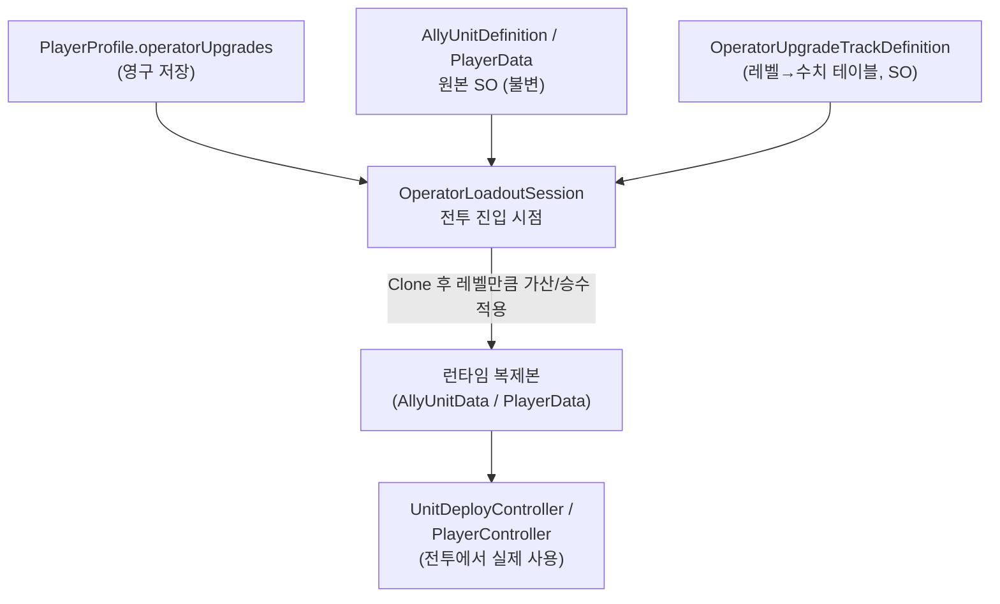
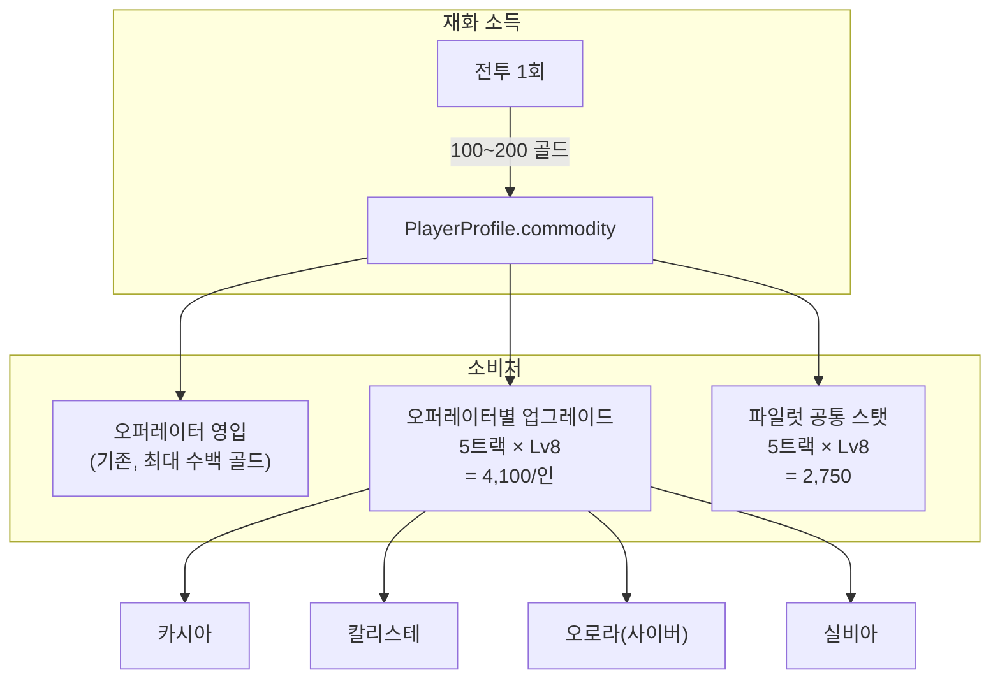
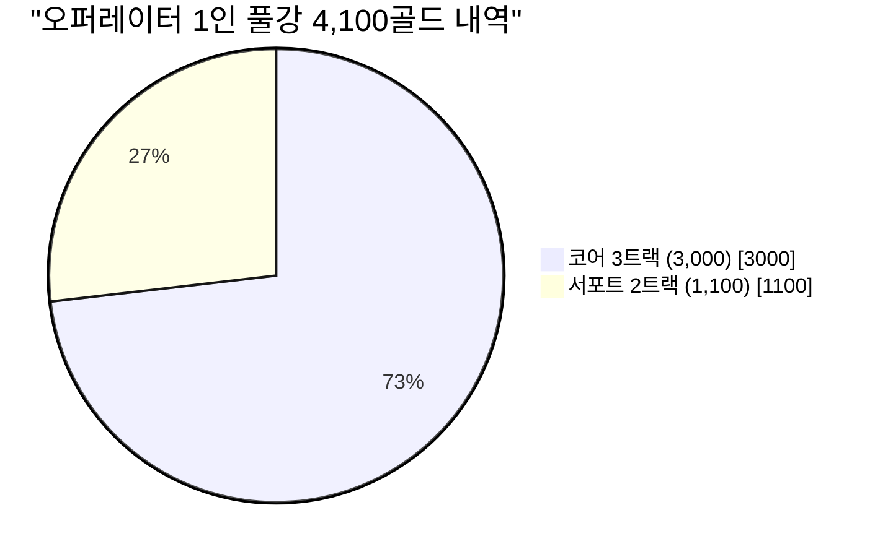

# 오퍼레이터 업그레이드 시스템 설계안

> `PlayerProfile.commodity`(계정 재화, UI 표기 "골드")를 소비해 오퍼레이터별 로스터 특화 수치를
> 영구 강화하는 시스템의 수치 설계안. 전투 중에만 쓰고 사라지는 `GameManager`의 인런(in-run)
> 골드와는 다른 자원이며, 현재 `commodity`의 유일한 소비처는 `OperatorManagementUI`의
> 오퍼레이터 영입(예: 칼리스테 100골드)뿐이다 — 이 문서가 제안하는 강화 시스템이 두 번째
> 소비처가 된다.

---

## 0. 요약 (TL;DR)

| 항목 | 값 |
|---|---|
| 트랙 구성 | 오퍼레이터당 **코어 3트랙 + 서포트 2트랙**, 트랙당 **Lv1~Lv8** |
| 오퍼레이터 1인 풀강 총 비용 | **4,100 골드** (코어 3,000 + 서포트 1,100) |
| 4개 오퍼레이터 전원 풀강 총 비용 | **16,400 골드** |
| 런당 평균 획득 골드 | **100~200** (기본 100 + 생존 1분당 20, 최대 +100) |
| 표준 진행(평균 3분 생존, 160골드/런) 기준 **4인 전원 풀강** 소요 | 약 **103런** (요청한 "100런 완주" 목표) |
| 표준 진행 기준 1인 풀강 소요 | 약 26런 |
| 강화 Lv1 진입 장벽 | **첫 런(최소 100골드)만으로 여러 트랙 Lv1~2를 동시 구매** 가능할 만큼 낮춤 |

> v1(초안) 대비 전 트랙 비용을 **약 1/8 수준**(`globalCostMultiplier ≈ 0.125`, §7.4)으로
> 완화한 개정판. 레벨별 스탯 증가량(§4)은 그대로 유지하고 **가격만** 낮췄다 — "쎄지는 정도"는
> 안 바꾸고 "도달 시간"만 100런 안팎으로 당긴 것.

설계 원칙(코드베이스 확인 결과 반영):
- 현재 각 오퍼레이터는 아군 유닛을 **정확히 2종**만 보유한다 (`cassia-guard`/`cassia-vanguard`,
  `calliste-guard`/`calliste-drone`, `aurora-debuff-drone`/`aurora-slow-drone`,
  `racing-heavy`/`racing-pitcrew`). 이전 대화에서 언급된 "스커미셔", "자폭 드론", "래피드 스피더"는
  아직 로스터·코드에 존재하지 않는 로드맵 유닛이므로, 이번 수치 설계는 **실제 구현된 필드**만
  대상으로 하고 로드맵 유닛은 §7.5에 확장 지점으로만 남긴다.
- 모든 수치는 실제 애셋/스크립트 기본값(`Assets/Editor/AllyUnitRecipes/*.json`,
  `Assets/Data/Effects/Unit/*.asset`, `UnitDeployController.cs`, `GameResultUI.cs`)에서 읽은
  값을 기준선으로 삼는다.

---

## 1. 재화 소득 기준선

`GameResultUI.cs`가 전투 종료(승/패 무관) 시 `PlayerProfile.AddCommodity`를 호출하는 공식:

```
지급 골드 = baseCommodityReward(100)
          + min(maxCommodityTimeBonus(100), floor(생존시간(분)) × commodityPerCompletedMinute(20))
```

| 생존 시간 | 완료 분(分) 보너스 | 런당 지급 골드 |
|---|---|---|
| 0~59초 | 0분 | 100 |
| 1분~1분59초 | 1분 | 120 |
| 2분대 | 2분 | 140 |
| 3분대 | 3분 | 160 |
| 4분대 | 4분 | 180 |
| **5분 이상 (상한)** | 5분+ | **200 (캡)** |



설계에 쓸 3가지 플레이어 프로필(요구치 산정용 가정치):

| 프로필 | 평균 생존 | 런당 평균 골드 |
|---|---|---|
| 느린 진행(초심자) | ~1분 | 120 |
| **표준 진행(기준)** | ~3분 | **160** |
| 숙련 진행(캡 도달) | 5분+ | 200 |

---

## 2. 시스템 구조

**권장안: A(레벨형 선형 강화) 기반 + C(호감도 게이팅)를 옵션으로 결합.**
순수 3택 특성 트리(B)는 로스터가 2유닛뿐인 현재 규모에서는 분기를 만들 상태 공간이 부족해
과설계이므로 보류하고, 유닛 로스터가 3종 이상으로 늘어나는 시점(§7.5)에 재검토한다.

### 2.1 데이터 스키마 (코드 수정 없는 데이터 기반 원칙 준수)

```csharp
// PlayerProfile.cs에 추가할 필드 — 기존 operatorAffinities 리스트와 동일한 패턴
public List<OperatorUpgradeRecord> operatorUpgrades = new List<OperatorUpgradeRecord>();

[Serializable]
public class OperatorUpgradeRecord
{
    public string operatorId;   // "cassia" | "calliste" | "aurora" | "racing"
    public string trackId;      // 예: "cassia.guard-armor"
    public int level;           // 0~8 (0 = 미강화)
}
```

`JsonUtility`는 `Dictionary`를 직렬화하지 않는다는 기존 프로젝트 제약(`PlayerProfile.cs:29-31`
주석) 그대로 리스트로 저장하고, 조회는 `operatorAffinities`와 동일하게 선형 탐색 헬퍼
(`GetUpgradeLevel(operatorId, trackId)` / `TryPurchaseUpgrade(...)`)로 감싼다.
`CurrentSchemaVersion`을 5 → 6으로 올리고, 기존 세이브는 `operatorUpgrades == null`일 때
빈 리스트로 마이그레이션한다(레벨 0 = 미강화이므로 별도 보정 불필요).

### 2.2 트랙 정의는 SO로 외부화

각 트랙의 `baseCost`/`costMultiplier`/`Lv1~8 수치`를 C# 상수로 박지 않고
`OperatorUpgradeTrackDefinition`(ScriptableObject) 애셋으로 노출한다 — 기존
`AllyUnitDefinition`/`OperatorCatalogEntry`와 동일한 "SO 원본 불변 + Recipe JSON" 패턴을
그대로 재사용할 수 있다(`Assets/Editor/AllyUnitRecipes/*.json` ↔ `Assets/Data/AllyUnits/*`
와 동형으로 `Assets/Editor/OperatorUpgradeRecipes/*.json` ↔
`Assets/Data/OperatorUpgrades/*`를 신설).

### 2.3 적용 시점: 전투 진입 시 클론에 가산

`OperatorLoadoutSession`이 `PlayerData`/`AllyUnitData`를 런타임 복제(Clone)하는 지점에
프로필의 레벨을 조회해 가산/승수 계수를 주입한다. 원본 SO 애셋은 절대 건드리지 않는다.



`UnitDeployController`의 `startingCommandPoints`/`maxCommandPoints`/
`commandPointRecoveryPerSecond`처럼 SO가 아닌 씬 컴포넌트 필드는, 같은 지점에서
`UnitDeployController`에 `ApplyOperatorUpgrades(profile)` 초기화 메서드를 추가해 `Awake()`
직후(스폰 이전) 1회 주입한다.

### 2.4 UI

`OperatorManagementUI`에 있는 골드 부족 안내 패턴(`OperatorManagementUI.cs:126`,
`"골드가 부족합니다. 필요 {price} / 보유 {commodity}"`)을 그대로 재사용하는 신규
"강화" 탭을 로비에 추가한다. 트랙별로 현재 레벨 → 다음 레벨 미리보기 수치와 비용을 표시.

---

## 3. 공통 비용 커브

모든 오퍼레이터·모든 트랙이 같은 2개의 커브(코어/서포트)를 공유해 밸런싱 지점을 하나로
모은다. 후반 레벨로 갈수록 비용이 급격히 늘어나는 백로드형 곡선(초반 접근성 확보 +
엔드게임 그라인드 목표 확보).

| 레벨 | 코어 트랙 비용 | 코어 누적 | 서포트 트랙 비용 | 서포트 누적 |
|---|---|---|---|---|
| Lv1 | 20 | 20 | 10 | 10 |
| Lv2 | 35 | 55 | 15 | 25 |
| Lv3 | 55 | 110 | 25 | 50 |
| Lv4 | 80 | 190 | 40 | 90 |
| Lv5 | 120 | 310 | 60 | 150 |
| Lv6 | 170 | 480 | 90 | 240 |
| Lv7 | 230 | 710 | 130 | 370 |
| Lv8 | 290 | **1,000** | 180 | **550** |

```mermaid
xychart-beta
    title "레벨당 요구 골드 (코어 vs 서포트)"
    x-axis [Lv1, Lv2, Lv3, Lv4, Lv5, Lv6, Lv7, Lv8]
    y-axis "요구 골드" 0 --> 320
    bar [20, 35, 55, 80, 120, 170, 230, 290]
    bar [10, 15, 25, 40, 60, 90, 130, 180]
```


*(mermaid `xychart-beta` 미지원 뷰어에서는 위 표 참고. 첫 막대=코어, 둘째 막대=서포트)*

### 3.1 구간별 요구치 (질문 1의 "몇 레벨로 쪼개고 구간별 재화 요구치")

| 구간 | 코어 트랙 비용 | 코어 비중 | 서포트 트랙 비용 | 서포트 비중 |
|---|---|---|---|---|
| 도입부 (Lv1-2) | 55 | 5.5% | 25 | 4.5% |
| 중반 성장 (Lv3-5) | 255 | 25.5% | 125 | 22.7% |
| 엔드게임 심화 (Lv6-8) | 690 | 69% | 400 | 72.7% |

### 3.2 오퍼레이터 1인 풀강 총합

오퍼레이터당 코어 3트랙 + 서포트 2트랙:

```
1인 풀강 = 코어누적(1,000) × 3 + 서포트누적(550) × 2
        = 3,000 + 1,100 = 4,100 골드
```

| 오퍼레이터 | 코어 3트랙 | 서포트 2트랙 | 합계 |
|---|---|---|---|
| 카시아 / 칼리스테 / 오로라(사이버) / 실비아 (동일 구조) | 3,000 | 1,100 | **4,100** |
| **4인 전원 풀강** | 12,000 | 4,400 | **16,400** |

### 3.3 런 수 환산 (질문 1의 "최대 레벨 업그레이드에는 총 얼마가 필요하며")

| 목표 | 필요 골드 | 느린 진행(120/런) | 표준 진행(160/런) | 숙련 진행(200/런) |
|---|---|---|---|---|
| 코어 트랙 Lv1 | 20 | 1런 | 1런 | 1런 |
| 서포트 트랙 Lv1 | 10 | 1런 | 1런 | 1런 |
| 코어 트랙 풀강(Lv8) | 1,000 | 9런 | 7런 | 5런 |
| **오퍼레이터 1인 풀강** | 4,100 | 35런 | 26런 | 21런 |
| **4인 전원 풀강** | 16,400 | 137런 | **103런** | 82런 |

> 표준 진행(160골드/런) 기준으로 4인 전원 풀강이 정확히 요청 수준인 **~100런**에 맞춰졌다.
> 진행 속도가 느린 플레이어는 ~137런, 숙련 플레이어는 ~82런으로 자연스러운 편차가 생기며,
> 정확히 100런에 맞추고 싶다면 §7.4의 `globalCostMultiplier`를 0.976배 더 곱하면 된다
> (16,400 × 0.976 ≈ 16,000 = 100런 × 160골드).

---

## 4. 오퍼레이터별 트랙 상세 (질문 2: 레벨별 증가 수치)

각 트랙은 실제 코드/애셋의 기본값을 Lv0 기준선으로 놓고 Lv1~Lv8까지 선형 보간한다.
[코어]/[서포트] 표기는 §3의 비용 커브 적용 대상을 가리킨다.

### 🛡️ 4.1 카시아 (Cassia) — 정석 수성

기준 유닛: `cassia-guard`(방호 요원, HP40/DMG6/배치20), `cassia-vanguard`(전진 사수,
HP20/DMG3/사거리6/배치40).

| 트랙 | 대상 필드 | Lv0(기본) | Lv1 | Lv2 | Lv3 | Lv4 | Lv5 | Lv6 | Lv7 | Lv8 |
|---|---|---|---|---|---|---|---|---|---|---|
| [코어] 방호 요원 장갑 강화 | `cassia-guard.maxHealth` | 40.0 | 43.2 | 46.4 | 49.6 | 52.8 | 56.0 | 59.2 | 62.4 | **65.6** |
| [코어] 전진 사수 화력 강화 | `cassia-vanguard.attackDamage` | 3.0 | 3.3 | 3.6 | 3.9 | 4.2 | 4.5 | 4.8 | 5.1 | **5.4** |
| [코어] 초기 CP 지급 | `startingCommandPoints`(가산) | +0 | +3 | +6 | +9 | +12 | +15 | +18 | +21 | **+24** |
| [서포트] 전진 사수 사거리 연장 | `cassia-vanguard.attackRange` | 6.0 | 6.3 | 6.6 | 6.9 | 7.2 | 7.5 | 7.8 | 8.1 | **8.4** |
| [서포트] 방호 요원 배치 비용 절감 | `cassia-guard.deployCost` | 20 | 19 | 18 | 17 | 16 | 15 | 14 | 13 | **13** |

체감: Lv7(+21 CP)부터 방호 요원(20 CP)을 전투 시작과 동시에 즉시 배치할 수 있어 초반
정석 수성이 훨씬 안정된다.

### 🎰 4.2 칼리스테 (카지노/베스퍼) — CP 가속 & 물량 공세

기준 유닛: `calliste-guard`(중장갑 센티넬, HP60/배치60), `calliste-drone`(서포트 드론,
버프 ×1.35/×1.35, 이속2.0/배치40). CP 인프라 기본값(`UnitDeployController`):
maxCommandPoints=100, commandPointRecoveryPerSecond=4.0/s.

| 트랙 | 대상 필드 | Lv0 | Lv1 | Lv2 | Lv3 | Lv4 | Lv5 | Lv6 | Lv7 | Lv8 |
|---|---|---|---|---|---|---|---|---|---|---|
| [코어] CP 회복 가속 | `commandPointRecoveryPerSecond` | 4.0/s | 4.2 | 4.4 | 4.6 | 4.8 | 5.0 | 5.2 | 5.4 | **5.6/s** |
| [코어] CP 상한 확장 | `maxCommandPoints` | 100 | 106 | 113 | 119 | 125 | 131 | 138 | 144 | **150** |
| [코어] 전술 드론 버프 증폭 | `TacticalRelayAuraEffect` 배율 | ×1.35 | ×1.38 | ×1.41 | ×1.44 | ×1.47 | ×1.50 | ×1.53 | ×1.57 | **×1.60** |
| [서포트] 서포트 드론 기동성 | `calliste-drone.moveSpeed` | 2.0 | 2.1 | 2.2 | 2.3 | 2.4 | 2.5 | 2.6 | 2.7 | **2.8** |
| [서포트] 중장갑 센티넬 요새화 | `calliste-guard.maxHealth` | 60.0 | 63 | 66 | 69 | 72 | 75 | 78 | 81 | **84** |

### 🌐 4.3 오로라 (사이버) — 디버프형 구역 장악

기준 유닛: `aurora-debuff-drone`(중장갑 약화 드론, HP80/사거리6),
`aurora-slow-drone`(중장갑 감속 드론, HP100/사거리12). 디버프 효과:
`VulnerableAuraEffect.damageTakenMultiplier`=×1.3(재적용 0.5s),
`SlowAuraEffect.speedMultiplier`=×0.625(재적용 0.8s, 낮을수록 강한 감속).

| 트랙 | 대상 필드 | Lv0 | Lv1 | Lv2 | Lv3 | Lv4 | Lv5 | Lv6 | Lv7 | Lv8 |
|---|---|---|---|---|---|---|---|---|---|---|
| [코어] 취약 디버프 증폭 | `VulnerableAuraEffect.damageTakenMultiplier` | ×1.30 | ×1.33 | ×1.37 | ×1.40 | ×1.43 | ×1.46 | ×1.49 | ×1.52 | **×1.55** |
| [코어] 감속 강화 | `SlowAuraEffect.speedMultiplier`(↓clip강함) | ×0.625 | ×0.603 | ×0.581 | ×0.559 | ×0.538 | ×0.516 | ×0.494 | ×0.472 | **×0.450** |
| [코어] 드론 순찰 기동성 | 양 드론 `moveSpeed` | 2.5 | 2.625 | 2.75 | 2.875 | 3.0 | 3.125 | 3.25 | 3.375 | **3.5** |
| [서포트] 디버프 재적용 유예 연장 | `VulnerableAuraEffect.refreshDuration` | 0.5s | 0.56 | 0.63 | 0.69 | 0.75 | 0.81 | 0.88 | 0.94 | **1.0s** |
| [서포트] 드론 장갑 강화 | `aurora-debuff-drone.maxHealth` / `aurora-slow-drone.maxHealth` | 80 / 100 | 84/105 | 88/110 | 92/115 | 96/120 | 100/125 | 104/130 | 108/135 | **112/140** |

체감: 감속 강화 트랙은 `speedMultiplier`가 낮아질수록 강해지는 역방향 지표이므로 UI에는
"감속률 37.5% → 55%"처럼 반전 표기가 필요하다(§7.6 UI 노트 참고).

### 🏎️ 4.4 실비아 (Racing) — 피트월 디펜스

기준 유닛: `racing-heavy`(헤비 페이스카, HP60/배치60), `racing-pitcrew`(피트크루 로버,
이속8.0/배치40). 수리 효과: `PitCrewRepairAuraEffect.repairPerSecond`=2,
`pitStopMultiplier`=×2.0(교전 중 정지 상태 한정).

| 트랙 | 대상 필드 | Lv0 | Lv1 | Lv2 | Lv3 | Lv4 | Lv5 | Lv6 | Lv7 | Lv8 |
|---|---|---|---|---|---|---|---|---|---|---|
| [코어] 피트스톱 수리력 | `PitCrewRepairAuraEffect.repairPerSecond` | 2.0 | 2.2 | 2.4 | 2.6 | 2.8 | 3.0 | 3.2 | 3.4 | **3.6** |
| [코어] 정지 피트스톱 배율 | `pitStopMultiplier` | ×2.0 | ×2.1 | ×2.2 | ×2.3 | ×2.4 | ×2.5 | ×2.6 | ×2.7 | **×2.8** |
| [코어] 헤비 페이스카 차단선 보강 | `racing-heavy.maxHealth` | 60 | 64 | 69 | 73 | 78 | 82 | 87 | 91 | **96** |
| [서포트] 피트크루 로버 기동성 | `racing-pitcrew.moveSpeed` | 8.0 | 8.3 | 8.6 | 8.9 | 9.2 | 9.5 | 9.8 | 10.1 | **10.4** |
| [서포트] 헤비 페이스카 배치 비용 절감 | `racing-heavy.deployCost` | 60 | 58 | 56 | 53 | 51 | 49 | 47 | 45 | **45** |

---

## 5. 파일럿(PlayerData) 공통 스탯 강화

오퍼레이터 전용 트랙과 별도로, 조작 캐릭터 자체(`PlayerData`)에 적용하는 **오퍼레이터
공용** 5트랙. 기준값은 GDD상 "세부 수치 미확정"으로 명시돼 있어(`PlayerData.cs:9`) 현재
Recipe JSON들의 공통 기본값(`maxHealth 30 / moveSpeed 5 / attackDamage 5 / attackRange 4 /
skillCooldown 12`)을 Lv0으로 사용한다. 비용 커브는 §3의 서포트 트랙을 그대로 적용(파일럿
생존기는 오퍼레이터 로스터보다 우선순위가 낮은 후순위 투자로 설계).

| 트랙 | 대상 필드 | Lv0 | Lv8(목표) | 커브 |
|---|---|---|---|---|
| 최대 체력 | `maxHealth` | 30 | 42 (+40%) | 서포트 |
| 이동 속도 | `moveSpeed` | 5.0 | 6.0 (+20%) | 서포트 |
| 피격 무적 시간 | `hitInvulnerabilityDuration` | 0.5s(가정) | 0.8s | 서포트 |
| 기본 공격력 | `attackDamage` | 5.0 | 7.0 (+40%) | 서포트 |
| 스킬 쿨다운 | `skillCooldown` | 12.0s | 8.4s (-30%) | 서포트 |

5트랙 모두 서포트 커브(550) 적용 시 파일럿 풀강 = **2,750 골드** (오퍼레이터 1인 풀강의
약 67%, 이전 안과 동일한 비율 유지). `hitInvulnerabilityDuration`은 실제 인스펙터 기본값
확인 전까지 가정치이므로 구현 시 재검증 필요.

---

## 6. 시각화 — 전체 그림





---

## 7. 기타 사양 (질문 3)

### 7.1 구매/검증 로직

`PlayerProfile`에 다음 헬퍼를 `TryPurchaseOperator`와 동일한 패턴으로 추가:

```csharp
public int GetUpgradeLevel(string operatorId, string trackId); // 없으면 0
public bool TryPurchaseUpgradeLevel(string operatorId, string trackId, int cost);
```

내부적으로 `TrySpendCommodity(cost)` → 성공 시 레벨 +1. 실패 시 UI는 §2.4의 골드 부족
문구 패턴을 재사용한다. 레벨 상한(8)을 넘는 구매 시도는 UI 단에서 버튼 비활성화로 막는다.

### 7.2 선행 조건 (옵션 — 호감도 게이팅)

강제 사항은 아니지만, 이미 구현된 `OperatorAffinityTier`(Unfamiliar/Favorable/Joy/Love,
`PlayerProfile.cs:211-230`)와 자연스럽게 엮을 수 있다:

| 레벨 구간 | 요구 호감도 티어 |
|---|---|
| Lv1-4 | 제한 없음 |
| Lv5-6 | Favorable(25) 이상 |
| Lv7-8 | Joy(50) 이상 |

이 게이팅은 "재화는 있는데 아직 못 여는" 장기 목표를 만들어, 로비 상호작용(호감도 획득)과
강화 시스템을 유기적으로 연결한다(원안의 옵션 C). MVP에서는 끄고, 데이터 기반 플래그
(`OperatorUpgradeTrackDefinition.requiredAffinityTier`)로 언제든 켤 수 있게만 설계한다.

### 7.3 리셋 정책

기본은 **비가역**(레벨 다운/환불 없음) — 기존 오퍼레이터 영입이 비가역인 것과 동일한
디자인 언어를 유지한다. "재분배권" 같은 별도 소모품은 향후 로드맵으로 남긴다(이번
범위에서 구현하지 않음).

### 7.4 밸런싱 노브

`OperatorUpgradeTrackDefinition`에 다음 필드를 노출해 코드 수정 없이 전체 경제를
스케일링할 수 있게 한다:

- `baseCost` / `costGrowthPerLevel` (현재 코어 150→2500, 서포트 100→1400 커브를 대체 가능)
- `globalCostMultiplier` (전역 인플레이션 조정용 — 이번 개정판 자체가 초안 대비
  `×0.125`를 적용한 결과다. 예: 여기서 다시 0.8배 하면 4인 전원 풀강이 약 13,120골드
  ≈ 82런(표준 진행)으로 더 축소된다)
- `maxLevel` (기본 8, 유닛 로스터 확장 시 조정 여지)

### 7.5 로드맵 확장 지점

이전 대화에서 언급된 "스커미셔", "자폭 드론"(20 CP), "래피드 스피더"는 현재
`AllyUnitRoster`에 없다(각 오퍼레이터는 2유닛만 보유). 해당 유닛이 실제로 추가되면:
- 오퍼레이터당 트랙 수를 5 → 7(코어 4 + 서포트 3 등)로 확장
- §3의 커브를 그대로 재사용하되 1인 풀강 총액만 비례 증가

로 자연스럽게 확장 가능하도록 트랙 정의를 SO 리스트로 설계했다(§2.2).

### 7.6 UI 주의사항

- **역방향 지표 표기**: `SlowAuraEffect.speedMultiplier`처럼 낮을수록 강해지는 필드는
  UI에 "감속률 X%"로 환산해 보여준다(`(1 - speedMultiplier) × 100`).
- **CP 표기 단위**: `commandPointRecoveryPerSecond`는 소수 첫째 자리까지, `maxCommandPoints`는
  정수로 반올림 표기(§4.2 표의 CP 상한 값은 이미 정수 반올림 적용됨).
- **배치 비용 하한**: `deployCost` 절감 트랙은 Lv7과 Lv8이 동일 값으로 수렴하는 경우가
  있다(반올림 결과) — 의도된 완만화이며 버그 아님.

### 7.7 스키마 마이그레이션 체크리스트

- `PlayerProfile.CurrentSchemaVersion` 5 → 6
- `operatorUpgrades` 필드 추가, null 방어 (`??= new List<...>()`) 기존 패턴 재사용
- 기존 세이브 로드 시 레벨 0 = 미강화로 자연 처리되므로 별도 마이그레이션 로직 불필요
  (단, 저장소 구현체 `PlayerPrefsProfileStorage`의 버전 체크 분기에 6 케이스 추가 필요)
