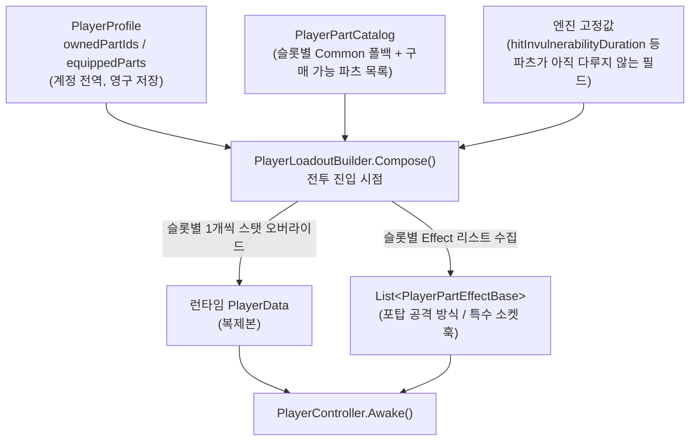
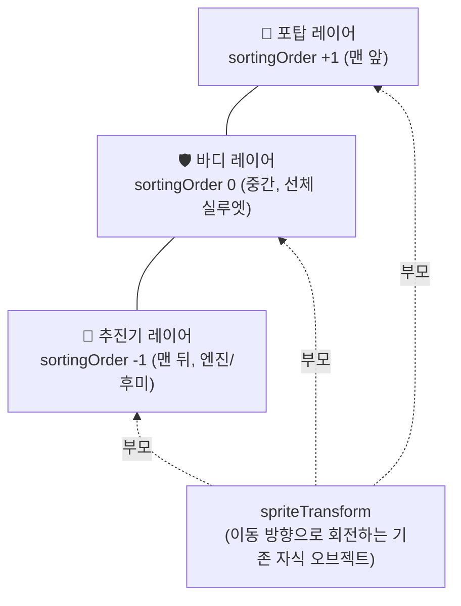

# 플레이어 기체 파츠 시스템 설계안

> [`오퍼레이터_업그레이드_설계안.md`](./오퍼레이터_업그레이드_설계안.md)의 舊 §5 "파일럿(PlayerData) 공통 스탯
> 강화"(레벨형 선형 강화)를 폐기하고 대체하는 문서. 오퍼레이터별 특화 강화(§4, 이미 구현 완료 —
> `OperatorUpgradeTrackSet`/`OperatorUpgradeApplier`)는 그대로 유지되며 이 시스템과 공존한다.
> 재화(`PlayerProfile.commodity`)와 런당 소득 기준선은 舊 문서 §1을 그대로 참조한다(100~200골드/런).

---

## 0. 요약 (TL;DR)

| 항목 | 값 |
|---|---|
| 교체 대상 | 舊 §5 "파일럿 공통 스탯 강화" (레벨 Lv1~8 선형 강화) — **폐기** |
| 신규 개념 | "갈아 끼우는" 장비형 강화 — **플레이어 기체 파츠 시스템** |
| 슬롯 구성 | **추진기 / 포탑 / 바디 / 드라이버 / 특수 소켓** 5부위, 슬롯당 파츠 1개만 장착 |
| 소유 범위 | **계정 전역 1세트** (오퍼레이터별이 아님 — §2.1 근거) |
| 등급 4단계 | **Common(0%) → Advanced(+30%) → Elite(+70%) → Legendary**(평시 +45~55%, Elite보다 비쌈 + 조건부 룰 브레이커 기믹) — §2.3 |
| 기본 장착 | 특수 소켓을 제외한 4부위는 현재 `PlayerData` 기본값을 그대로 재현하는 **Common 등급 파츠**가 구매 없이 항상 장착 |
| 판매 정책 | 이미 구매한 파츠를 **구매가의 40%**로 환급 판매 가능(§6.2). Common 파츠는 자산이 아니므로 판매 대상이 아님 |
| 재화 | 기존 `PlayerProfile.commodity`를 그대로 사용(舊 문서와 같은 지갑, 새 소비처만 추가) |
| 선행 리팩터링 | (1) `PlayerController`의 공격 로직을 아군 유닛과 동일한 `Effect` 훅으로 분리, (2) 오버드라이브 스킬 파라미터를 컴포넌트 하드코딩에서 데이터 기반으로 승격 — §3 |
| 콘텐츠 파이프라인 | 기존 `AllyUnitRecipes`/`OperatorRecipes` JSON→SO 레시피 패턴과 `LiveCatalogService` 원격 카탈로그 패턴을 그대로 재사용해 파츠도 빌드 이후 라이브 드롭 가능 — §7 |
| 비주얼 시스템 | 추진기/포탑/바디 3슬롯만 인게임 기체 외형에 반영(드라이버·특수 소켓은 상점 아이콘만). 3레이어 오버레이 합성 + 슬롯당 상점 아이콘/인게임 오버레이 2종 자산 필요 — §9 |

---

## 1. 배경 — 왜 레벨형 강화를 파기하는가

舊 §5는 `maxHealth`/`moveSpeed`/`attackDamage`/`skillCooldown`/`hitInvulnerabilityDuration` 5개
필드를 Lv1~8 선형 보간으로 밀어 올리는 "그냥 쎄지는" 강화였다. 실제 코드를 다시 확인한 결과 두
가지가 새로 드러났다:

1. **5개 오퍼레이터(`Cassia`/`Calliste`/`Aurora`/`Racing`/`Valentina`) 모두 `playerData` 기본값이
   완전히 동일**하다(`Assets/Editor/OperatorRecipes/*.json` 전수 확인 — 5개 파일 모두
   `maxHealth 30 / moveSpeed 5 / attackDamage 5 / attackRange 4 / attackInterval 1 /
   projectileSpeed 1 / skillCooldown 12 / skillRange 5 / skillDamage 5`, `hitInvulnerabilityDuration`은
   舊 문서가 가정한 0.5초가 아니라 **0.0초**). 즉 "파일럿 공통 스탯"은 이름 그대로 오퍼레이터와
   무관하게 이미 계정 전역 단일 값이었다 — 이 사실이 §2.1의 소유 범위 결정 근거가 된다.
2. `PlayerController`의 오버드라이브(스킬) 세부 동작(`skillBurstCount`/`skillBurstInterval`/
   `skillMoveSpeedMultiplier`)은 `PlayerData`가 아니라 **컴포넌트의 private `SerializeField`**로
   하드코딩돼 있다(`PlayerController.cs:47-51`). 레벨형 강화든 파츠든, 스킬 지속시간·2스택 같은
   기믹을 만들려면 이 값들을 먼저 데이터 계층으로 끌어올려야 한다 — §3.2.

레벨형 강화는 "쎄지는 정도"만 조절할 뿐 플레이 방식을 바꾸지 못한다. 반면 파츠는 "이중 배럴이냐
관통 레이저냐"처럼 상호 배타적인 선택을 만들어 로스터 확장 없이도 매 런의 무장 구성에 변주를 준다.

---

## 2. 시스템 구조

### 2.1 소유 범위: 오퍼레이터별이 아니라 계정 전역 "기체" 1대

`OperatorDefinition.playerData`는 오퍼레이터마다 별도 필드로 존재하지만(§1에서 확인했듯 현재는
값이 전부 동일한 플레이스홀더), 이 설계는 **파츠 로드아웃을 오퍼레이터가 아니라 계정에 귀속**시킨다.
근거:

- 원안 문장 자체가 "**플레이어**는 총 5부위의 파츠를 갖는다"로, "오퍼레이터마다"가 아니다.
- 지금도 모든 오퍼레이터의 기본 스펙이 동일해 오퍼레이터별로 분리해야 할 실익이 없다.
- 오퍼레이터별로 분리하면 파츠 구매/판매 경제가 오퍼레이터 수(5배)만큼 복잡해지고, 오퍼레이터를
  바꿀 때마다 재조립해야 하는 마찰이 생긴다. "어느 오퍼레이터로 타든 같은 기체를 조종한다"는
  프레이밍이 자연스럽다.

> 이 가정이 기획 의도와 다르면(예: 오퍼레이터별로 별도 기체를 굴리고 싶다면) §4.2의
> `PlayerPartLoadoutRecord`에 `operatorId`를 키로 추가하는 것으로 확장 가능하다 — 스키마 설계
> 단계에서부터 이 경우를 감안해 뒀다.

오퍼레이터별 특화 강화(舊 §4, CP/유닛 스탯/오라 배율 — `OperatorUpgradeTrackSet`)는 대상이
아군 유닛과 배치 인프라라서 이 결정과 무관하며 그대로 유지된다.

### 2.2 슬롯 정의

| 슬롯 | 관장 스탯 | 대응 `PlayerData` 필드 | 게임플레이 성격 |
|---|---|---|---|
| 🚀 추진기 (Thruster) | 이동 속도 | `moveSpeed` | 순수 수치형 + 오버드라이브 연동 기믹 여지 |
| 🔫 포탑 (Turret) | 기본 공격 | `attackDamage`/`attackRange`/`attackInterval`/`projectileSpeed` + **공격 판정 방식 자체** | 상호 배타적 기믹(단발/이중 배럴/관통/스플래시) |
| 🛡️ 바디 (Body) | 최대 체력 | `maxHealth` | 순수 수치형 (§5.3에서 생존 기믹 확장 여지만 메모) |
| ⚙️ 드라이버 (Driver) | 오버드라이브(스킬) | `skillCooldown`/`skillRange`/`skillDamage` + 버스트 파라미터(§3.2 승격 후) | 쿨다운/지속/데미지/스택 등 다축 기믹 |
| 🔮 특수 소켓 (Special) | 없음(신규) | 없음 — 신규 `PlayerPartEffectBase` 훅 | 부활/패시브 힐 등 룰 브레이커 기믹 |

슬롯당 파츠 1개만 장착 가능하며, 파츠 교체는 **로비에서만** 가능하다(전투 중 교체 불가 — 기존
오퍼레이터 로드아웃 확정 시점과 동일하게 `OperatorLoadoutSession`이 씬 진입 시 1회 조합한다).

### 2.3 등급 체계

같은 슬롯 안에서도 "무엇을 하느냐(기믹)"와 "얼마나 세냐(등급)"를 분리한다. 예를 들어 관통 레이저는
하나의 **아키타입**(`archetypeId: "pierce-laser"`)이고, 그 안에 `Mk1(Advanced)`/`Mk2(Elite)` 두
**등급** 변형이 존재하는 식이다(원안의 "레이저 기본형/고급형" 요청을 그대로 반영).

| 등급 | 성격 | 주 수치 축 목표 상승률(순수 스탯형 기준) | 가격대(예시) | 비고 |
|---|---|---|---|---|
| **Common** | 현재 `PlayerData` 기본값 그대로. 특수 소켓 제외 4슬롯에 구매 없이 항상 장착 | 0% (기준선) | 0 (구매 불가, 판매 불가) | "미착용" 상태를 없애기 위한 항상-존재 폴백 |
| **Advanced (고급)** | 수치 상승 또는 첫 기믹 도입 | **+30%** | 150~260골드 | 1~2런이면 도달 |
| **Elite (정예)** | 같은 기믹의 강화판, 순수 수치 극한 | **+70%** | 400~650골드 | 3~5런 분량, 엔드게임 그라인드 목표 |
| **Legendary (전설)** | 룰 브레이커급 상황부 기믹 전용 — 평시(발동 전) 수치는 **Advanced보다 위, 순수 Elite보다는 아래**(대략 +45~55%)로 절제하고, 진짜 값어치는 조건부 기믹에서 나온다 | +45~55%(평시) + 조건부 기믹 | Elite보다 항상 비싸게, 550~650골드+ | 등급 자체가 "기믹으로 승부"라는 신호 — 순수 수치 극대화가 목적이면 Elite가 더 효율적이게 의도적으로 설계 |

**밸런스 원칙(세부 수치 산정 규칙)**: 같은 슬롯의 여러 아키타입이라도 "총 데미지/총 효율" 축이
같으면 같은 등급에서 같은 상승률을 맞춘다 — 예컨대 §5.4에서 "스킬 피해 배율을 올리는 화력형"과
"스킬 타격 횟수를 늘리는 지속형"은 둘 다 **스킬 1회당 총 피해량**이라는 같은 축을 공유하므로,
Advanced/Elite 각각에서 동일한 +30%/+70%를 맞추도록 정정했다(舊 버전은 지속형이 화력형보다
실질 배율이 훨씬 높게 새는 오류가 있었다 — §5.4 참고). 반대로 관통/스플래시/연쇄처럼 **다수
대상**을 전제로 한 판정은 단일 대상 DPS로 직접 비교할 수 없는 축이라 이 규칙 밖에 둔다(각 표에
조건부 수치임을 명시).

`OperatorUpgradeTrackSet`의 Core/Support 2분류와 마찬가지로, 등급 구간도 `PlayerPartGrade` enum으로
데이터에 노출해 코드 수정 없이 5번째 등급(예: 이벤트 한정 "Prototype")을 얹을 수 있게 한다(§7.5).

### 2.4 적용 시점 — 기존 로드아웃 조립 지점 재사용

`OperatorLoadoutSession.CreatePlayerData(fallback)`이 현재 `OperatorDefinition.playerData`를
그대로 복제하는 지점을, **계정 파츠 로드아웃을 조립하는 지점**으로 대체한다. 원본 SO(파츠
Definition, 오퍼레이터 Definition)는 건드리지 않고 매 전투 진입마다 새 값 객체를 만드는 기존
원칙(`OperatorLoadoutSession.cs:86-87` 주석)을 그대로 따른다.



`PlayerController.Awake()`의 `data = OperatorLoadoutSession.CreatePlayerData(data);` 한 줄을
`(data, effects) = OperatorLoadoutSession.ComposePlayerLoadout(data);`로 확장하는 정도의 변경으로
끝난다 — 호출부 시그니처만 넓어질 뿐 조립 책임의 위치는 그대로다.

---

## 3. 선행 리팩터링 (구현 착수 전 필수 확인 사항)

원안이 요청한 "지금 스킬 구현이 어떻게 되어 있는지 확인" 결과, 두 가지 리팩터링이 파츠 시스템보다
먼저(또는 같이) 필요하다.

### 3.1 포탑 공격 로직의 Effect화

현재 `PlayerController.TryAutoAttack()`은 "가장 가까운 적 1체에게 `data.attackDamage` 고정 피해 +
가짜 투사체 스폰"을 컴포넌트 코드에 직접 작성해 뒀다(`PlayerController.cs:220-249`). 이중
배럴/관통/스플래시처럼 **판정 방식 자체가 다른** 포탑 파츠를 데이터로 얹으려면, 아군 유닛이 이미
쓰고 있는 패턴을 플레이어에도 이식해야 한다:

- `IAllyUnitEffect`/`AllyUnitEffectBase`(`OnSpawn`/`OnTick`/`OnAttack`/`OnDeath` 훅) → 대응하는
  `IPlayerPartEffect`/`PlayerPartEffectBase`.
- `IAllyUnitPrimaryAttackEffect`(주 공격 중복 조합을 막는 표식 인터페이스, 최근 에디터 검증기로
  강제됨 — [`아군_유닛_이펙트_조합_가이드.md`](./아군_유닛_이펙트_조합_가이드.md) 참고) → 대응하는
  `IPlayerPrimaryAttackEffect`. 포탑 슬롯에는 정확히 이 표식을 가진 파츠 1개만 허용되도록 같은
  방식의 에디터 검증기를 그대로 복제한다.
- `PierceAttackEffect`/`SplashAttackEffect`/`BasicAttackEffect`(Ally 버전)를 그대로 참고해
  `PlayerBasicAttackEffect`/`PlayerTwinBarrelAttackEffect`/`PlayerPierceAttackEffect`/
  `PlayerSplashAttackEffect`를 새로 작성한다. `AllyUnitContext` 대응품(`PlayerAttackContext` 등,
  self/activeEnemies 참조)만 새로 정의하면 나머지 판정 수학(`PierceAttackMath`/`SplashAttackMath`)은
  기존 것을 그대로 재사용할 수 있다.

`TryAutoAttack()`은 "타겟 탐색 + 쿨다운 체크"까지만 남기고, 실제 피해 적용은
`_turretEffect.OnAttack(ctx, target)` 위임으로 바뀐다 — 아군 유닛의 `OnAttack` 훅 호출 지점과
동일한 모양이다.

### 3.2 오버드라이브 스킬 파라미터의 데이터 승격

`skillBurstCount`/`skillBurstInterval`/`skillMoveSpeedMultiplier`(`PlayerController.cs:47-51`)는
현재 인스펙터에 박힌 컴포넌트 상수라 드라이버 파츠가 건드릴 방법이 없다. 다음 중 하나로 데이터
계층에 옮겨야 한다:

- **(권장) `PlayerData`에 필드 3개 추가** — `skillBurstCount`/`skillBurstInterval`/
  `skillOverdriveMoveSpeedMultiplier`. 舊 §5가 이미 `skillCooldown`/`skillRange`/`skillDamage`를
  `PlayerData` 필드로 다뤘던 것과 같은 결로, 드라이버 파츠의 스탯 오버라이드 대상에 자연스럽게
  편입된다.
- (대안) 별도 `PlayerSkillModuleDefinition` SO로 분리 — "2스택" 같은 상태 기계형 기믹까지 감안하면
  장기적으로는 이쪽이 깔끔하지만, 당장은 필드 3개 이전만으로 §5.4의 예시 파츠 대부분을 구현할 수
  있어 1차 범위에서는 과설계다. "2스택"(스킬 재사용 대기 중에도 충전 1회 더 비축)만큼은 단순 필드로
  안 되고 `_skillChargesAvailable` 같은 카운터 상태가 `PlayerController`에 별도로 필요하다 — 이
  부분만 §5.4에서 "추가 리팩터링 필요"로 명시 표시한다.

---

## 4. 데이터 스키마

### 4.1 파츠 정의 SO — 기존 SO 패턴 재사용

`AllyUnitDefinition`/`OperatorUpgradeTrack`과 동형으로, 코드 수정 없이 파츠를 추가할 수 있게
`ScriptableObject` + JSON 레시피 조합을 그대로 쓴다.

```csharp
// Assets/Scripts/Definitions/Part/PlayerPartDefinition.cs
[CreateAssetMenu(menuName = "RCCom/Player Part/Part Definition")]
public class PlayerPartDefinition : ScriptableObject
{
    public string partId;              // 저장 데이터·Addressables 주소 키
    public PlayerPartSlot slot;        // Thruster | Turret | Body | Driver | Special
    public PlayerPartGrade grade;      // Common | Advanced | Elite | Legendary
    public string archetypeId;         // 같은 기믹의 Mk1/Mk2를 묶는 그룹 키 (UI 정렬용)
    public string displayName;
    [TextArea(2, 4)] public string description;
    [Min(0)] public int price;         // Common은 0 고정(검증기로 강제)

    public PlayerPartStatOverride statOverride;      // 슬롯이 관장하는 PlayerData 필드 절대값
    public List<PlayerPartEffectBase> effects = new(); // 기믹(포탑 판정 방식·특수 소켓 훅 등)
    public Sprite icon;
}
```

`PlayerPartStatOverride`는 슬롯별로 의미 있는 필드만 노출한다(포탑 파츠에 `maxHealth`를 넣는 실수를
막기 위해 슬롯-필드 매핑을 에디터 검증기로 강제 — `AllyUnitAssetValidator.cs`가 주 공격 중복을
막는 것과 같은 접근):

| 슬롯 | `PlayerPartStatOverride` 노출 필드 |
|---|---|
| 추진기 | `moveSpeed`, (Legendary 한정) `skillOverdriveMoveSpeedMultiplier` |
| 포탑 | `attackDamage`, `attackRange`, `attackInterval`, `projectileSpeed` |
| 바디 | `maxHealth` |
| 드라이버 | `skillCooldown`, `skillRange`, `skillDamage`, `skillBurstCount`, `skillBurstInterval` |
| 특수 소켓 | 없음(수치 오버라이드가 아니라 `effects`만 사용) |

파츠는 델타(가산)가 아니라 **절대값 오버라이드**다 — 슬롯당 1개만 장착되는 구조라 "여러 파츠의
델타를 누적"할 일이 없고, 상점 UI에서 "현재 값 → 교체 시 값"을 그냥 두 파츠의 절대값 비교로 보여줄
수 있어 舊 §4의 델타 누적 로직(`OperatorUpgradeModifier.GetDelta`)보다 오히려 단순하다.

### 4.2 `PlayerProfile` 확장 (스키마 버전 6 → 7)

```csharp
// PlayerProfile.cs에 추가 — operatorUpgrades와 동일한 리스트 저장 패턴
public List<string> ownedPartIds = new List<string>();
public List<PlayerPartLoadoutRecord> equippedParts = new List<PlayerPartLoadoutRecord>();

[Serializable]
public class PlayerPartLoadoutRecord
{
    public string slot;    // PlayerPartSlot.ToString() — JsonUtility는 enum도 직렬화하지만
                            // 슬롯 종류 추가/순서 변경에 안전하도록 문자열로 저장
    public string partId;  // 비어 있으면 해당 슬롯은 Common 폴백으로 간주
}
```

- `GetEquippedPartId(slot)`: 레코드가 없거나 `partId`가 소유 목록(`ownedPartIds`)에 없으면(판매
  후 잔존 참조 등 손상 데이터 방어) 카탈로그의 **Common 폴백 파츠 ID**를 반환한다.
- `TryPurchasePart(partId, price)`: `TrySpendCommodity` → 성공 시 `ownedPartIds`에 추가(이미
  소유 중이면 실패 — 오퍼레이터 영입과 동일한 멱등 가드).
- `TryEquipPart(slot, partId)`: `partId`가 Common 폴백이거나 `ownedPartIds`에 있을 때만 레코드
  갱신. 슬롯 불일치(포탑 파츠를 바디 슬롯에 끼우기 등)는 카탈로그 조회로 거부.
- `TrySellPart(partId, refundAmount)`: 소유 목록에서 제거 + `AddCommodity(refundAmount)`. 판매된
  파츠가 현재 장착 중이면 해당 슬롯 레코드를 지워 자동으로 Common 폴백으로 되돌린다(장착 슬롯이
  빈 채로 남는 상태를 만들지 않는다 — §6.2).

Common 파츠는 `ownedPartIds`에 존재하지 않아도 항상 장착 가능한 폴백이므로, "구매하지 않았는데
장착 중"인 상태가 데이터 무결성 문제가 아니라 **의도된 기본값**이라는 점을 저장 계층 주석에 명시한다.

### 4.3 마이그레이션

- `PlayerProfile.CurrentSchemaVersion` 6 → 7.
- `ownedPartIds`/`equippedParts` null 방어(`??= new List<...>()`) — 기존 세이브 로드 시 빈
  리스트로 자연 처리되고, 모든 슬롯이 Common 폴백이 되므로 **파츠 도입 전/후 스탯이 그대로
  유지**된다(회귀 없음).
- `PlayerPrefsProfileStorage`의 버전 체크 분기에 7 케이스 추가.
- `OperatorDefinition.playerData` 필드는 즉시 제거하지 않는다 — 파츠 카탈로그가 아직 못 뜬
  씬(에디터 단독 테스트 등)의 폴백으로 당분간 유지하고, Common 파츠 4종의 수치 원본(§1에서 확인한
  공통값)으로만 취급한다. 완전 제거는 §7.5 로드맵에 남긴다.

---

## 5. 파츠 카탈로그 예시 (질문 4 — 슬롯별 아이디어 구체화)

아래 수치는 §2.3의 등급별 목표 상승률(+30%/+70%, Legendary는 그 사이)을 채우기 위한 **예시**이며
확정치가 아니다(舊 문서와 같은 톤 — 구조와 상대적 격차가 핵심이고 절대 수치는 플레이테스트로
조정). 원안이 제시한 기믹 외에 슬롯마다 최소 1개씩 신규 아키타입을 더 얹어 "무엇을 낄지" 선택의
폭을 넓혔다.

### 5.1 🚀 추진기 (Thruster)

| 파츠 | 등급 | `moveSpeed` | 기믹 | 가격 |
|---|---|---|---|---|
| 표준 추진기 (Common) | Common | 5.0 | — | 0 |
| 부스트 추진기 Mk1 | Advanced | 6.5 (+30%) | — | 180 |
| 부스트 추진기 Mk2 | Elite | 8.5 (+70%) | — | 460 |
| **관성 추진기 Mk1** *(신규)* | Advanced | 5.75 (+15%, 평시는 순수형보다 낮음) | 같은 방향으로 1.5초 이상 직진 시 속도가 서서히 붙어 최대 **+45%까지(누적 7.25)**, 방향 전환 시 즉시 초기화 | 170 |
| **관성 추진기 Mk2** *(신규)* | Elite | 6.75 (+35%) | 위와 동일한 가속 기믹, 가속 시간 1.5→1.0초로 단축, 누적 상한을 **+90%(누적 9.5)**로 확장 — 순수 Elite(8.5)를 넘어서는 유일한 지점 | 440 |
| **오버부스트 추진기** | Legendary | 7.5 (+50%, Advanced~Elite 사이) | 오버드라이브(스킬) 발동 **중 내내**(기본 1.2초, 지속형/이중 코어 드라이버로 연장 가능 — §5.4) 이동속도 배율을 1.5×→**3.0×**로 대체 + 발동 즉시 0.6초 고정방향 대시(입력 무시, 반드시 발동) | 620 |

**설계 검증(舊 버전의 지배 관계 오류 수정)**: 이전 초안은 관성 Mk2가 부스트 Mk2와 **같은 상한
(8.5)에 더 비싼 가격(480>460)**으로 도달해 순수 지배당하는 실수가 있었다 — 평시에도 약하고
최대치도 같으면서 더 비싸면 고를 이유가 없다. 지금 버전은 "관성형은 항상 순수형보다 **싸고**,
평시엔 더 약하지만, 실력만 받쳐주면 순수형의 상한을 **넘어선다**"는 위험-보상 구조로 다시 짰다
(Mk1: 170<180, 상한 7.25>6.5 / Mk2: 440<460, 상한 9.5>8.5). `오버부스트 추진기`도 "0.4초 대시
하나 보려고 평시 이속 1.0을 버리는" 걸로 읽히던 문제를 고쳤다 — 실제 payoff는 대시가 아니라
**오버드라이브가 켜져 있는 전체 시간 동안** 이동속도가 거의 3배가 되는 것이고(지속형 드라이버로
발동 1회의 지속시간 자체를 늘리거나, 이중 코어 드라이버로 연속 발동해 우세 구간을 이어 붙이면
payoff도 같이 커지는 명시적 시너지가 있다 — §5.4), 대시는 그 위에 얹는 보너스다. `오버부스트 추진기`는 §3.2에서 데이터로 승격한 `skillOverdriveMoveSpeedMultiplier`를
오버라이드하는 가장 직접적인 Legendary 사용 예다.

### 5.2 🔫 포탑 (Turret)

| 파츠 | 등급 | 아키타입 | 판정 | 가격 |
|---|---|---|---|---|
| 표준 포탑 (Common) | Common | single | 단발, DPS 100%(기준) | 0 |
| 다연장 포탑 Mk1 "이중 배럴" | Advanced | multi-barrel | 0.12초 간격 2연사, 발당 피해 ×0.65(합 DPS **+30%**) | 200 |
| 다연장 포탑 Mk2 "삼중 배럴" | Elite | multi-barrel | 0.10초 간격 3연사, 발당 피해 ×0.567(합 DPS **+70%**) | 500 |
| 관통 레이저 포탑 Mk1 | Advanced | pierce-laser | 최대 3개체 관통, 관통마다 피해 −20% (단일 대상 DPS는 기준과 동일 — 다수 대상 조건부 화력) | 220 |
| 관통 레이저 포탑 Mk2 | Elite | pierce-laser | 최대 6개체 관통, 관통마다 피해 −12% | 520 |
| 스플래시 포탑 Mk1 | Advanced | splash | 주 타격 100% + 반경 1.2 스플래시 40%(조건부) | 210 |
| 스플래시 포탑 Mk2 | Elite | splash | 주 타격 100% + 반경 1.8 스플래시 65%(조건부) | 510 |
| **연쇄 스파크 포탑 Mk1** *(신규)* | Advanced | chain-spark | 주 타겟 100% → 방향 무관 최근접 적으로 최대 2회 전이, 전이마다 −30%(조건부, 밀집 3체 기준 최대 219%) | 230 |
| **연쇄 스파크 포탑 Mk2** *(신규)* | Elite | chain-spark | 최대 4회 전이, 전이마다 −20%(조건부, 밀집 5체 기준 최대 336%) | 530 |
| **코어 오버로드 포탑** | Legendary | overload | 단발, DPS **+50%**(Advanced~Elite 사이) + 오버드라이브(스킬) 발동 중 3초간 판정이 관통(최대 3체)으로 임시 전환 | 650 |

`관통 레이저`/`스플래시`/`연쇄 스파크`는 §2.3의 밸런스 원칙대로 "다수 대상 조건부 화력" 축이라
단일 대상 DPS(다연장 포탑 계열)와 직접 비교 대상이 아니다 — 관통은 일직선상, 연쇄는 방향 무관
최근접 우선이라 서로도 "몰려 있는 적 vs 흩어진 적"에서 유불리가 갈리도록 의도적으로 다르게
설계했다. 포탑 슬롯은 §3.1의 `IPlayerPrimaryAttackEffect` 검증기로 슬롯당 정확히 1개의 판정
방식만 허용된다.

### 5.3 🛡️ 바디 (Body)

| 파츠 | 등급 | `maxHealth` | 기믹 | 가격 |
|---|---|---|---|---|
| 표준 바디 (Common) | Common | 30 | — | 0 |
| 강화장갑 바디 Mk1 | Advanced | 39 (+30%) | — | 170 |
| 강화장갑 바디 Mk2 | Elite | 51 (+70%) | — | 430 |
| **재생장갑 바디 Mk1** *(신규)* | Advanced | 34.5 (+15%, 평시는 순수형보다 낮음) | 3초간 무피격 시 초당 최대체력 2% 재생 시작(피격 시 즉시 중단·재적립) | 190 |
| **재생장갑 바디 Mk2** *(신규)* | Elite | 42 (+40%) | 2초간 무피격 시 초당 4% 재생 | 460 |
| **리액티브 바디** | Legendary | 45 (+50%, Advanced~Elite 사이) | 피격 무적시간 0.0s→**0.5s** 동반 부여 | 560 |

`재생장갑`은 회피 위주 플레이에 보상을 주는 축, `강화장갑`은 순수 맷집 축으로 분리했다. `리액티브
바디`는 §1에서 확인한 `hitInvulnerabilityDuration`(현재 0.0)을 살려 순수 체력 상승과는 다른 생존
축(피격 자체를 줄이기)을 Legendary 전용 기믹으로 배정했다.

### 5.4 ⚙️ 드라이버 (Driver — 오버드라이브)

스킬 축은 세 갈래(쿨다운/피해량/타격 횟수)가 있는데, **피해량 배율**과 **타격 횟수**는 둘 다
"스킬 1회당 총 피해량"이라는 같은 지표를 올리는 축이라 반드시 같은 등급에서 같은 상승률로
맞춰야 한다 — 舊 초안은 지속형(4→10연타, 총 피해 +150%)이 화력형(최대 ×1.9, +90%)보다 훨씬
세게 새는 오류가 있었다(둘 다 같은 자원 지출인데 지속형이 압도적으로 우월). 아래 표는 세 축 모두
+30%(Advanced)/+70%(Elite)로 재계산했다. 원안에 없던 **사거리형**도 신규로 추가했다
(`skillRange`가 이미 `PlayerData` 필드인데도 예시에서 빠져 있었다).

| 파츠 | 등급 | 효과 | 스킬 1회당 총 피해(또는 등가 DPS) | 가격 |
|---|---|---|---|---|
| 표준 드라이버 (Common) | Common | 쿨다운 12s / 4연타 × 5.0 피해, 0.3s 간격 | 총 피해 20 / 12s = **DPS 1.67(기준)** | 0 |
| 쿨감 드라이버 Mk1 | Advanced | 쿨다운 −25%(9.0s) | DPS **1.67×1.33 = +33%** | 200 |
| 쿨감 드라이버 Mk2 | Elite | 쿨다운 −42%(7.0s) | DPS **1.67×1.71 = +71%** | 470 |
| 화력 드라이버 Mk1 | Advanced | 스킬 피해 ×1.30 | 총 피해 20→26 = **+30%** | 200 |
| 화력 드라이버 Mk2 | Elite | 스킬 피해 ×1.70 | 총 피해 20→34 = **+70%** | 470 |
| 지속형 드라이버 Mk1 | Advanced | 연타 4→5회 | 총 피해 20→25 = **+25%** | 190 |
| 지속형 드라이버 Mk2 | Elite | 연타 4→7회 | 총 피해 20→35 = **+75%** | 480 |
| **사거리형 드라이버 Mk1** *(신규)* | Advanced | 스킬 사거리 5.0→6.5 | (수치 축 상이, DPS 무관 — 안전 거리 확보) | 170 |
| **사거리형 드라이버 Mk2** *(신규)* | Elite | 스킬 사거리 5.0→8.5 | (수치 축 상이) | 420 |
| **이중 코어 드라이버** | Legendary | 쿨다운 기준값을 8.0s로 고정(DPS +50%, Advanced~Elite 사이) | 스킬을 **최대 2회 비축**(쿨다운 완료 전에도 1회분 선충전) 가능 | 640 |

화력형은 "단일 강적을 짧고 굵게", 지속형은 "약한 다수를 길게 쓸어담기"로 실전 용도가 갈리게
설계했다 — 총 피해 기댓값은 같은 등급에서 동일하지만 대상 상황에 따라 체감이 달라지는 것이
의도다. 지속형은 타격 횟수가 정수일 수밖에 없어 목표치(+30%/+70%)에 가장 가까운 정수(5회/7회 →
+25%/+75%)로 반올림했다 — 목표에서 5%p 이내로 오차를 의도적으로 허용한 결과이지 계산 누락이
아니다. `이중 코어 드라이버`는 §3.2의 "대안" 리팩터링(스킬 충전 카운터 도입)이 별도로 필요하다 —
작업 티켓 분리를 권장한다.

### 5.5 🔮 특수 소켓 (Special Socket)

특수 소켓은 기본 장착 파츠가 없다(빈 슬롯 = 아무 효과 없음). 신규 `PlayerPartEffectBase` 훅
(`OnSpawn`/`OnTick`/`OnDamaged`/`OnSkillUsed`/`OnDeath`, 아군 유닛 Effect 훅과 동형)만으로
구현되며 스탯 오버라이드는 갖지 않는다.

| 파츠 | 등급 | 효과 | 가격 | 구현 난이도 |
|---|---|---|---|---|
| 패시브 재생 모듈 Mk1 | Advanced | 초당 최대체력 3% 자연 회복 | 240 | `OnTick` 훅만으로 충분 |
| 패시브 재생 모듈 Mk2 | Elite | 초당 4% + 스킬 사용 시 즉시 20% 회복 | 520 | `OnTick` + `OnSkillUsed` |
| **충전형 보호막 모듈 Mk1** *(신규)* | Advanced | 8 피해 흡수 배리어, 10초마다 재충전(최대 1스택) | 260 | `OnTick`(재충전 타이머) + `OnDamaged`(흡수 우선 처리) |
| **충전형 보호막 모듈 Mk2** *(신규)* | Elite | 14 피해 흡수 배리어, 7초마다 재충전 | 540 | 위와 동일 |
| **1회 부활 모듈** | Legendary | 패배 조건(플레이어 사망 **또는** 베이스 파괴) 도달 시 1회에 한해 무효화 — 플레이어는 최대체력 50%로 즉시 부활(1.5초 무적), 베이스 파괴였다면 베이스 체력을 최소치로 복구. 전투당 1회, 재충전 없음 | 600 | **신규 엔진 훅 필요** — 아래 참고 |
| **코어 오버로드 모듈** *(신규)* | Legendary | 초당 3.5% 회복(패시브 재생 Mk1~Mk2 사이) + 체력이 30% 이하로 처음 떨어질 때 3초 무적 + 즉시 25% 회복(쿨다운 45초, **재사용 가능**) | 630 | `OnTick` + `OnDamaged`(임계값 감시) — 신규 엔진 훅 불필요 |

`충전형 보호막`은 패시브 재생과 달리 "버스트 피해 한 방을 통째로 무효화"하는 축이라 지속 회복과는
쓰임이 다르다(둘 다 특수 소켓에 두는 것이 자연스러워 같은 슬롯에 공존). `코어 오버로드 모듈`은
`1회 부활 모듈`과 같은 "위기 극복" 컨셉이지만 **쿨다운 기반으로 반복 사용 가능한 대신 완전한
죽음 무효화는 아닌** 절제된 버전으로 넣어, 같은 Legendary 등급 안에서도 "한 방 보험(부활)" vs
"반복되는 안전망(오버로드)" 중 취향대로 고르게 했다.

`1회 부활 모듈`은 원문("내가 터지든 베이스가 터진 딱 한 번")을 "플레이어 사망 조건과 베이스 파괴
조건 중 **먼저 발생하는 쪽**을 통틀어 1회 무효화"로 해석했다. 이는 `PlayerController.Died`
이벤트만으로는 못 만든다 — `GameManager`(또는 패배를 최종 판정하는 지점)에 **패배 확정 직전에
장착 파츠에게 무효화 기회를 주는 인터셉트 훅**(예: `IGameOverInterceptor.TryPreventGameOver()`)이
새로 필요하다. 이 부분이 특수 소켓 카테고리 전체에서 유일하게 "파츠 정의만으로 안 끝나고 전투
종료 판정 로직 자체를 건드려야 하는" 항목이므로, 1차 구현 범위에서 제외하고 2차로 미루는 것도
합리적 선택지다(`코어 오버로드 모듈`은 이 훅 없이도 구현 가능하므로 1차 범위에 먼저 넣을 수 있다).

---

## 6. 경제 설계

### 6.1 재화 소득 — 기존 기준선 그대로 사용

舊 문서 §1의 `GameResultUI` 공식(기본 100골드 + 생존 분당 20골드, 최대 200골드 캡)을 그대로
쓴다. 새 소비처가 생겼다고 소득 쪽을 바꿀 이유는 없다.

### 6.2 판매 정책 — 구매가의 40% 환급

원안 3번 요구사항을 그대로 반영: 이미 구매한 파츠를 판매하면 **원래 구매가의 40%**를 돌려받는다
(`OperatorUpgradeTrack`처럼 레벨별 누적 투자액을 추적할 필요가 없어 계산이 단순하다 — 파츠 하나당
가격이 고정이므로 환급액도 `Mathf.FloorToInt(price * 0.4f)`로 고정).

- **비가역 손실 40%**를 의도적으로 남겨, "일단 사고 아무거나 껴본다"가 아니라 "다음 등급을 노리고
  현재 파츠를 정리한다"는 자원 관리 결정을 만든다(舊 문서 §7.3의 "기본 비가역" 철학과 같은 결).
- Common 파츠는 애초에 자산이 아니므로(구매한 적이 없음) 판매 대상에서 제외 — UI에서는 판매 버튼
  자체를 비활성화한다.
- 판매 후에도 상위 등급을 다시 사고 싶다면 전액을 다시 지불해야 한다("재분배권" 같은 완충 장치는
  舊 문서와 동일하게 이번 범위 밖 — 향후 로드맵).
- 장착 중인 파츠를 판매하면 해당 슬롯은 자동으로 Common 폴백으로 복귀한다(§4.2) — 빈 슬롯이
  생기는 UX를 원천 차단.

### 6.3 가격대와 기존 소비처의 관계

| 소비처 | 1회당 규모 | 성격 |
|---|---|---|
| 오퍼레이터 영입 (기존) | 최대 수백 골드, 1회성 | 로스터 확장 |
| 오퍼레이터별 강화 (舊 §4, 구현 완료) | 4,100골드/인 풀강 | 오퍼레이터 특화 성장 |
| **파츠 구매 (신규)** | Advanced 150~260 / Elite 400~650 | 계정 전역 "기체" 성장, 슬롯 교체형 |

5슬롯 전부 **순수 Elite**(다연장/삼중 배럴·강화장갑·쿨감·패시브 재생 등 수치형 위주)로 채우는 데
필요한 총액은 예시 카탈로그 기준 약 **2,380골드**(460+500+430+470+520). 5슬롯 전부
**Legendary**(§2.3의 "평시 Advanced~Elite 사이 + 기믹" 조합)로 채우면 약 **3,100골드**
(620+650+560+640+630)로, 순수 Elite 풀장착보다 한 단계 더 비싼 최종 목표가 된다 — 순수 수치
극대화(Elite)와 상황부 기믹(Legendary)이 서로 다른 최종 목표로 갈리게 한 것이 의도다. 두 값 모두
오퍼레이터 1인 풀강(4,100골드)보다는 가볍고, 영입 1회보다는 무거운 중간~후반 크기 목표다. 정확한
런 수 환산은 파츠 확정 목록이 나온 뒤 舊 문서 §3.3과 같은 표로 별도 채운다.

---

## 7. 콘텐츠 파이프라인 — 어드레서블 & 라이브 드롭

기존에 이미 검증된 두 계층을 그대로 재사용한다.

### 7.1 제작 파이프라인 (코드 수정 없는 데이터 추가)

`Assets/Editor/AllyUnitRecipes/*.json` ↔ `AllyUnitAssetRecipe.cs` ↔ `Assets/Data/AllyUnits/*`,
`Assets/Editor/OperatorRecipes/*.json` ↔ `OperatorAssetRecipe.cs` ↔ `Assets/Data/Operators/*`와
동형으로 신설한다:

```
Assets/Editor/PlayerPartRecipes/*.json   →  PlayerPartAssetRecipe.cs (신규 Editor 툴)
                                          →  Assets/Data/PlayerParts/*.asset (PlayerPartDefinition SO)
```

JSON 레시피 하나가 파츠 하나에 대응하며, 기획자가 SO 인스펙터를 직접 만지지 않고도 신규 파츠를
텍스트로 추가할 수 있다 — `AllyUnitRecipeMigrator.cs`와 같은 마이그레이터도 스키마가 바뀔 때 그대로
복제해 쓴다.

### 7.2 원격 카탈로그 — 빌드 이후 신규 파츠 드롭

`OperatorManagementUI`가 쓰는 `LiveCatalogService.Resolve(catalog)` 패턴, 그리고 다운로드 전
선택 화면에 필요한 최소 정보만 담는 `OperatorCatalogEntry`(전체 Definition을 당기지 않고
`address`만 들고 있다가 필요 시 Addressables로 로드) 패턴을 그대로 파츠에 이식한다:

```csharp
// 로컬 상점 목록에 항상 존재 — 원격 신규 파츠는 remoteContent=true로 표시
public sealed class PlayerPartCatalogEntry
{
    public string partId;
    public PlayerPartSlot slot;
    public PlayerPartGrade grade;
    public string displayName;
    [TextArea(2,4)] public string description;
    public int price;
    public Sprite icon;              // 원격 콘텐츠는 다운로드 전 비워두고 iconAddress로 별도 로드
    public string iconAddress;
    public string address;           // PlayerPartDefinition 전체의 Addressables 주소
    public bool remoteContent;
}
```

`PlayerPartCatalog`(로컬 SO, 6개 고정 슬롯형 `OperatorCatalog`와 달리 슬롯 개수 제한 없음)를
`AddressablesRemoteProfileConfigurator`/`AddressablesContentUpdateBuilder`/
`AddressablesReleaseManifest`/`AddressablesServerDataPackager` — 이미 오퍼레이터 라이브 콘텐츠에
쓰고 있는 파이프라인 그대로 통해 배포한다. 새 파츠 추가는 앱 업데이트 없이 "레시피 JSON 작성 →
SO 빌드 → Addressable 그룹 빌드 → 원격 카탈로그 갱신" 4단계로 끝난다.

### 7.3 어드레서블 그룹 분리

`AddressableGroupPolicy.cs`의 기존 그룹 정책에 슬롯별 라벨(`part-thruster`/`part-turret`/
`part-body`/`part-driver`/`part-special`)을 추가해, 특정 슬롯 파츠만 선별 다운로드/캐시 정리할 수
있게 한다(오퍼레이터 단위로 그룹을 나눈 기존 관례와 동일).

---

## 8. 상점 UI

`LobbyShopPanelUI`가 이미 Recruit/Enhance 2탭 구조(`OperatorRecruitShopUI`/
`OperatorEnhanceShopUI`)로 구현돼 있으므로, **3번째 탭 "파츠"**를 같은 패턴으로 추가한다:

- `shopPartsTabButton`/`shopPartsTabImage`/`partsPanel`/`OperatorPartsShopUI`(신규)를
  `LobbyShopPanelUI`의 기존 필드들과 나란히 추가하고 `ApplyMode()`에 3번째 분기만 얹는다.
- 파츠 탭 내부는 5개 슬롯 아이콘을 가로로 배치 → 슬롯 선택 시 해당 슬롯의 보유/구매 가능 파츠
  목록(현재 장착 파츠는 강조 테두리) → 파츠 선택 시 우측 패널에 스탯 비교(`현재 → 교체 시`)와
  구매/장착/판매 버튼.
- 골드 부족 안내는 `OperatorManagementUI.cs:126`의 `"골드가 부족합니다. 필요 {price} / 보유
  {commodity}"` 문구 패턴을 그대로 재사용한다.
- 판매 버튼은 Common 파츠 및 미보유 파츠에서 비활성화, 확인 다이얼로그(오확 판매 방지)를 거쳐
  즉시 처리한다.

---

## 9. 비주얼 시스템 — 파츠 장착에 따른 인게임 기체 외형 변경

파츠를 갈아 끼우면 로비 상점 아이콘뿐 아니라 **실제 전투 중 플레이어 기체의 생김새**도 바뀌어야
한다. 5슬롯 중 **추진기/포탑/바디** 3슬롯만 대상이고, 드라이버(오버드라이브 제어 소프트웨어 —
외부로 노출되는 부품이 아니다)와 특수 소켓(내장형 모듈 컨셉)은 인게임 외형에 관여하지 않는다 —
이 2슬롯은 지금처럼 상점 카드용 아이콘(§4.1의 기존 `icon` 필드)만 있으면 된다.

### 9.1 자산 요구 — 슬롯당 그래픽 2종

대상 3슬롯(추진기/포탑/바디)은 파츠 하나당 그래픽 자산이 2종 필요하다:

1. **상점용 UI 스프라이트** — §4.1에 이미 있는 `PlayerPartDefinition.icon` 필드를 그대로 쓴다(신규
   필드 아님).
2. **인게임 오버레이 스프라이트** *(신규)* — 전투 중 플레이어 기체 위에 겹쳐 그릴 파츠 그래픽.

### 9.2 3-레이어 오버레이 구조

현재 `PlayerController`는 `SpriteRenderer` 필드 하나(`spriteRenderer`)만 갖고 있고, 이 필드는
`.color`(피격 빨강 틴트/스킬 파랑 틴트, §"피격/스킬 시각 피드백")만 바꿀 뿐 `.sprite` 자체를
런타임에 교체하는 코드가 없다 — 함선 그래픽이 프리팹에 고정된 아트라는 뜻이다. 아군 유닛
쪽(`AllyUnitView.Bind()`)은 이미 `_spriteRenderer.sprite = visualSprite;`로 Definition의 스프라이트를
런타임에 입히고 있으므로, 플레이어 쪽에도 같은 성격의 데이터 기반 스프라이트 배정을 추가하는
것뿐이다 — 다만 파츠가 3개(추진기/바디/포탑)로 나뉘어 있으니 **단일 스프라이트가 아니라 3레이어
합성**이 된다.



3개를 각각 별도 `SpriteRenderer`로 분리해 기존 `spriteTransform`(이동 방향으로 회전하는 자식
오브젝트, `PlayerController.cs:41-45`) 밑에 나란히 자식으로 둔다 — 회전 보정
(`spriteForwardOffsetDegrees`)을 3벌 따로 관리할 필요 없이 부모 회전 하나에 전부 묻어간다. 정렬
순서는 뒤→앞으로 **추진기(엔진/후미, sortingOrder −1) → 바디(선체, 0) → 포탑(무장, +1)**로 고정한다
— 포탑이 선체 위에 얹히고 추진기는 선체 뒤에서 뿜어져 나오는 일반적인 소형 기체 실루엣 문법을
따른 기본값이며, 실제 미감은 아트 1차 결과물이 나온 뒤 재검증한다.

### 9.3 데이터 스키마 확장

```csharp
// PlayerPartDefinition (§4.1)에 필드 추가
public Sprite icon;            // 기존 — 상점 카드용, 5슬롯 전부 사용
public Sprite overlaySprite;   // 신규 — 추진기/포탑/바디 3슬롯 전용. 드라이버/특수 소켓은 null 고정.
```

§4.1에서 예고한 슬롯-필드 매핑 검증기(`AllyUnitAssetValidator.cs`와 같은 접근)에 다음 두 규칙을
추가한다:

- `slot`이 추진기/포탑/바디인데 `overlaySprite`가 비어 있으면 **경고**(아트가 아직 없어도 빌드는
  막지 않되, 릴리스 전 체크리스트에서 걸러야 함 — §9.5의 플레이스홀더로 진행 가능).
- `slot`이 드라이버/특수 소켓인데 `overlaySprite`가 채워져 있으면 **에러**(쓰이지 않는 필드에
  실수로 아트를 넣는 상황 차단).

### 9.4 런타임 적용

§2.4의 `PlayerLoadoutBuilder.Compose()`가 스탯/Effect뿐 아니라 3개 오버레이 스프라이트도 함께
반환하도록 확장한다:

```csharp
public readonly struct PlayerLoadoutResult
{
    public readonly PlayerData data;
    public readonly List<PlayerPartEffectBase> effects;
    public readonly Sprite thrusterOverlay;
    public readonly Sprite bodyOverlay;
    public readonly Sprite turretOverlay;
}
```

`PlayerController`는 단일 `spriteRenderer` 필드를 3개로 교체한다:

```csharp
[SerializeField] private SpriteRenderer thrusterLayer;
[SerializeField] private SpriteRenderer bodyLayer;
[SerializeField] private SpriteRenderer turretLayer;
```

`Awake()`에서 `AllyUnitView`의 `GetFallbackSprite()`와 동일한 폴백 규칙으로 3개 레이어에 스프라이트를
대입한다 — 아직 아트가 없는 파츠는 회색 placeholder 박스로 대체해 제작 진행을 막지 않는다(§9.5).
`UpdateSpriteTint()`(피격/스킬 틴트)는 단일 `spriteRenderer.color` 대입에서 **3개 레이어 전부에
같은 색을 대입**하도록 일반화해야 한다 — 그렇지 않으면 피격 시 바디만 빨개지고 포탑·추진기는
그대로인 어색한 결과가 난다.

### 9.5 에셋 제작 가이드 (아트 착수 지침)

에셋 제작이 이미 시작됐으므로, 다음 규격을 아트 담당에게 먼저 전달한다:

- **좌표계·피벗 공유**: 오버레이 스프라이트는 현재 프리팹의 단일 함선 스프라이트와 같은 원점·
  스케일·피벗을 공유해야 픽셀 단위로 어긋나지 않는다 — 기존 함선 스프라이트의 크기/피벗 값을
  먼저 레퍼런스로 전달할 것.
- **기준 방향**: `spriteForwardOffsetDegrees`(오른쪽 기준 0도)와 같은 기본 바라보는 방향으로
  그린다 — 회전은 부모(`spriteTransform`)가 통째로 처리하므로 파츠 아트가 방향별로 여러 장 필요
  하지는 않다.
- **투명 배경 + 마운트 규격화**: 바디 위에 포탑이 얹히는 구조이므로, 바디 아트의 포탑 마운트 위치를
  규격 좌표로 고정해 어떤 포탑 파츠를 얹어도 위치가 어긋나지 않게 한다(정확한 마운트 좌표는 1차
  스케치 이후 확정).
- **제작 우선순위**: **Common 등급 3종(표준 추진기/포탑/바디)을 가장 먼저 제작**한다 — "파츠
  미장착 시 기존 함선과 완전히 동일하게 보여야 한다"는 시각적 회귀 방지 기준선이며, §4.3에서 이미
  세운 "파츠 도입 전/후 스탯이 그대로 유지되어야 한다"는 원칙을 비주얼에도 그대로 적용한 것이다.
  그다음 우선순위는 §5 카탈로그의 실장 순서를 따르되 최종 순서는 팀 조율 사항.

### 9.6 상점 UI와의 접점 (범위 확인)

상점 UI 구현 자체는 이번 범위 밖이며 §8 그대로 다른 담당자가 진행한다 — 이 절이 정의하는 것은
그 UI가 소비할 **데이터 계약**뿐이다. 상점 UI는 §7.2의 `PlayerPartCatalogEntry.icon`(상점 카드용)만
참조하면 되고, `overlaySprite`는 인게임 전용이라 상점 화면에는 노출되지 않는다.

---

## 10. 마이그레이션 체크리스트

- [ ] `PlayerProfile.CurrentSchemaVersion` 6 → 7, `ownedPartIds`/`equippedParts` 필드 추가
- [ ] `PlayerPrefsProfileStorage` 버전 분기에 7 케이스 추가
- [ ] §3.1 — `PlayerController` 공격 로직을 `PlayerPartEffectBase.OnAttack` 훅으로 분리
- [ ] §3.2 — 오버드라이브 버스트 파라미터 3종을 `PlayerData` 필드로 승격
- [ ] `PlayerPartDefinition`/`PlayerPartCatalog`/`PlayerPartCatalogEntry` 등 신규 SO/클래스 작성
- [ ] `Assets/Editor/PlayerPartRecipes/*.json` + `PlayerPartAssetRecipe.cs` 레시피 파이프라인
- [ ] `OperatorLoadoutSession.CreatePlayerData` → `ComposePlayerLoadout`로 확장
- [ ] `LobbyShopPanelUI` 3탭화 + `OperatorPartsShopUI` 신규 작성
- [ ] (선택, 2차) §5.5 "1회 부활 모듈"을 위한 `IGameOverInterceptor` 훅
- [ ] §9.3 — `PlayerPartDefinition.overlaySprite` 필드 + 슬롯별 필수/금지 검증기 추가
- [ ] §9.4 — `PlayerController`의 단일 `spriteRenderer`를 3레이어(`thrusterLayer`/`bodyLayer`/
      `turretLayer`) 구조로 교체, `UpdateSpriteTint()` 일반화
- [ ] §9.5 — Common 등급 3종 오버레이 아트 우선 제작(시각 회귀 방지 기준선)

---

## 11. 로드맵 / 미해결 사항

- **오퍼레이터별 로드아웃 분리 여부**: §2.1에서 계정 전역으로 결정했지만, 오퍼레이터마다 다른
  기본 스펙을 부여하는 방향으로 GDD가 바뀌면 `PlayerPartLoadoutRecord`에 `operatorId`를 추가하는
  선에서 확장 가능하도록 스키마를 짜 뒀다.
- **등급 3단계 이상 확장**: `PlayerPartGrade`를 enum이 아니라 `Assets/Data/PlayerPartGrades/*`
  같은 SO 리스트로 바꾸면 이벤트 한정 등급도 코드 수정 없이 추가 가능 — 현재는 舊 문서 §7.4의
  `globalCostMultiplier` 같은 노브가 아직 없으므로, 파츠 전체 가격을 한 번에 스케일링할 전역
  배율도 §6.3 확정 후 함께 넣는다.
- **재분배권/파츠 저장 슬롯(로드아웃 프리셋)**: 판매 후 재구매 비용 부담을 완화하는 장치나, 여러
  파츠 조합을 저장해 뒀다가 즉시 전환하는 프리셋 기능은 이번 범위 밖 — 파츠 수가 늘어난 뒤
  재검토한다.
- **호감도 게이팅 연동 여부**: 舊 §4가 이미 `OperatorAffinityTier`와 강화 레벨을 옵션으로 엮어둔
  것과 달리, 파츠는 오퍼레이터 종속이 아니므로 호감도 게이팅을 걸 명분이 약하다 — 기본은 게이팅
  없음으로 설계했다.
